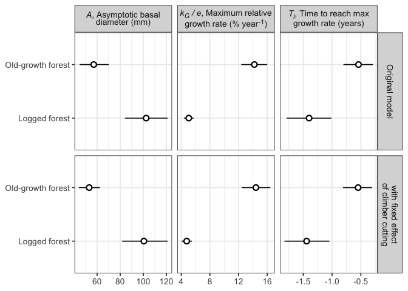

# Supplementary Information for the climber cutting plots
eleanorjackson
2025-09-09

``` r
library("tidyverse")
library("patchwork")
library("tidybayes")
library("brms")
library("modelr")
library("broom.mixed")
library("ggtext")
```

``` r
model_cc <- 
  readRDS(here::here("output", 
                   "models", 
                   "grow-extra",
                   "growth_model_base_p3_cc.rds"))

model_main <- readRDS(here::here("output",
                                 "models",
                                 "growth_model_base_p3_allo.rds"))
```

``` r
model_cc$formula
```

    dbase_mean ~ log(A) * exp(-exp(-(k * (years - delay)))) 
    A ~ 0 + forest_type + climber_cut + (0 + forest_type | genus_species) + (1 | plant_id)
    k ~ 0 + forest_type + climber_cut + (0 + forest_type | genus_species) + (1 | plant_id)
    delay ~ 0 + forest_type + climber_cut + (0 + forest_type | genus_species) + (1 | plant_id)

``` r
model_main$formula
```

    dbase_mean ~ log(A) * exp(-exp(-(k * (years - delay)))) 
    A ~ 0 + forest_type + (0 + forest_type | genus_species) + (1 | plant_id)
    k ~ 0 + forest_type + (0 + forest_type | genus_species) + (1 | plant_id)
    delay ~ 0 + forest_type + (0 + forest_type | genus_species) + (1 | plant_id)

``` r
my_coef_tab <- 
  tibble(fit = list(model_main, model_cc),
         model = c("Original model", 
                   "with fixed effect<br>of climber cutting")) %>%
  mutate(tidy = purrr::map(
    fit,
    broom.mixed::tidy,
    effect = "fixed")) %>% 
  select(-fit) %>% 
  unnest(tidy) %>% 
  filter(!grepl("prior", term)) %>% 
  filter(!grepl("cut", term)) %>% 
  rowwise() %>% 
  mutate(parameter = pluck(strsplit(term, "_"),1, 1)) %>% 
  mutate(forest_type = pluck(strsplit(term, "_"), 1, 3)) %>%
  mutate(forest_type = str_remove(forest_type, "type")) %>%
  mutate(forest_type =
           case_when(
             forest_type == "primary" ~ "Old-growth forest",
             forest_type == "logged" ~ "Logged forest",
             .default = forest_type
             )) %>% 
  mutate(estimate = case_when(
    parameter == "k" ~ (estimate / exp(1))*100,
    .default = estimate
  ),
  conf.low  = case_when(
    parameter == "k" ~ (conf.low  / exp(1))*100,
    .default = conf.low 
  ),
  conf.high = case_when(
    parameter == "k" ~ (conf.high / exp(1))*100,
    .default = conf.high
  )) %>%
  mutate(name = case_when(
    parameter == "A" ~ "<i>A</i>, Adult basal<br>diameter (mm)",
    parameter == "k" ~ "<i>k / e</i>, Maximum relative<br>growth rate (% year<sup>-1</sup>)",
    parameter == "delay" ~ "<i>delay</i>, Time to reach<br>max RGR (years)"
  ))
```

``` r
my_coef_tab %>% 
  ggplot(aes(x = forest_type, 
             y = estimate, 
             ymin = conf.low, ymax = conf.high)) +
  geom_pointrange(shape = 21, fill = "white") +
  labs(x = NULL,
       y = NULL) +
  coord_flip() +
  facet_grid(model~name, 
             scales = "free") +
  theme(strip.text = element_markdown())
```



``` r
model_survival <-
  readRDS(here::here("output", "models", "survival",
                     "survival_model_allo_nocenter.rds"))
```

``` r
model_survival$formula
```

    time_to_last_alive | cens(x = censor, y2 = time_to_dead) ~ 0 + forest_type + dbase_mean_sc + (0 + forest_type | genus_species) 

``` r
model_survival_cc <-
  readRDS(here::here("code",
                        "notebooks",
                        "models",
                        "2025-09-09_extra-survival-models",
                        "survival_climber_cut.rds"))
```

``` r
model_survival_cc$formula
```

    time_to_last_alive | cens(x = censor, y2 = time_to_dead) ~ 0 + forest_type + dbase_mean_sc + climber_cut + (0 + forest_type | genus_species) 

``` r
my_coef_tab_survival <- 
  tibble(fit = list(model_survival, model_survival_cc),
         model = c("Original model", 
                   "with fixed effect<br>of climber cutting")) %>%
  mutate(tidy = purrr::map(
    fit,
    broom.mixed::tidy,
    effect = "fixed")) %>% 
  select(-fit) %>% 
  unnest(tidy) %>% 
  filter(!grepl("prior", term)) %>% 
  filter(!grepl("cut", term)) %>% 
  rowwise() %>% 
  mutate(forest_type = pluck(strsplit(term, "_"), 1, 2)) %>%
  mutate(forest_type = str_remove(forest_type, "type")) %>% 
  mutate(forest_type =
           case_when(
             forest_type == "primary" ~ "Old-growth forest",
             forest_type == "logged" ~ "Logged forest",
             forest_type == "mean" ~ "Basal diameter",
             .default = forest_type
             )) 
```

``` r
my_coef_tab_survival %>% 
  ggplot(aes(x = forest_type, 
             y = estimate, 
             ymin = conf.low, ymax = conf.high)) +
  geom_pointrange(shape = 21, fill = "white") +
  labs(x = NULL,
       y = NULL) +
  coord_flip() +
  facet_grid(rows = vars(model), 
             scales = "fixed") +
  theme(strip.text = element_markdown())
```


