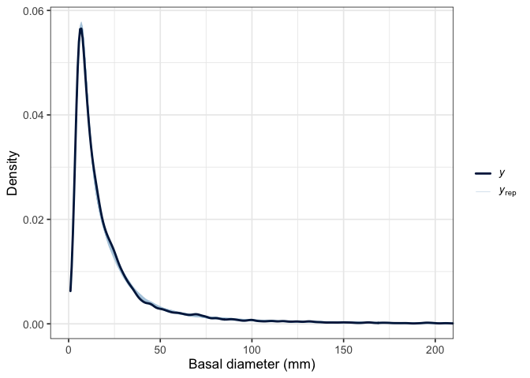
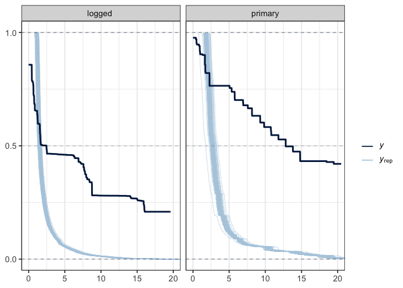
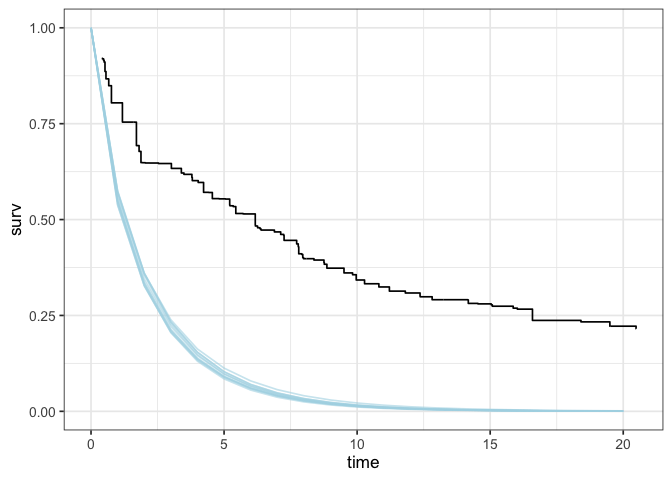

# Posterior predictive checks
eleanorjackson
2026-02-02

- [Growth](#growth)
- [Survival](#survival)
  - [Compare at Representative Covariate
    Values](#compare-at-representative-covariate-values)

``` r
library("tidyverse")
library("brms")
library("survival")
library("modelr")
library("tidybayes")
library("ggsurvfit")
library("bayesplot")
library("patchwork")
library("bayestestR")
```

## Growth

``` r
mod_gro <-
  readRDS(here::here("output", "models",
                     "growth_model.rds"))
```

``` r
pp_check(mod_gro)
```


Zoomed in:

``` r
pp_check(mod_gro, ndraws = 50) +
  coord_cartesian(xlim = c(0,200)) +
  ggplot2::theme_bw(base_size = 13) +
  labs(y = "Density", x = "Basal diameter (mm)") 
```



## Survival

``` r
mod_surv <-
  readRDS(here::here("output", "models",
                     "survival_model.rds"))

data_surv <-
  readRDS(here::here("data", "derived", "data_survival.rds")) %>%
  drop_na(dbase_mean)
```

We can use `bayesplot::ppc_km_overlay_grouped` for censored survival
models.

``` r
# 0 = right censored, 1 = event/death
data_surv <- 
  data_surv %>% 
  mutate(status = case_when(
         censor == "right" ~ 0,
         censor == "interval" ~ 1))

pp_weibull_shape <- 
  posterior_linpred(mod_surv, ndraws = 100, dpar = "shape",
                    re_formula = NA)

pp_weibull_mu <- 
  posterior_linpred(mod_surv, ndraws = 100, dpar = "mu",
                    re_formula = NA)

pp_weibull_scale <- 
  pp_weibull_mu/gamma(1+(1/pp_weibull_shape))

bayesplot::ppc_km_overlay_grouped(y = data_surv$time_to_last_alive, 
                                  yrep = pp_weibull_scale, 
                                  status_y = data_surv$status,
                                  group = data_surv$forest_type,
                                  extrapolation_factor = Inf) +
  coord_cartesian(xlim =c(0,20))
```



… However, Kaplan-Meier estimates don’t handle continuous covariates
well. In the figure above, basal diameter hasn’t been taken into
account - we know this is very important for predicting survival.

First, I’m going to try to recreate the
`bayesplot::ppc_km_overlay_grouped` figure. Then we can try to compare
the data and model estimates at representative values of our covariate
(basal diameter).

Get the K-M estimates:

``` r
fit_surv <- 
  survival::survfit(data = data_surv,
          survival::Surv(time = time_to_last_alive, 
               time2 = time_to_dead,
               type = "interval2") ~ 1)

fit_surv %>% 
  ggsurvfit::ggsurvfit(theme = theme_classic(base_size = 10)) +
  labs(
    x = "Years",
    y = "Survival probability"
  ) + 
  ggtitle("Kaplan-Meier plot") +
  ggsurvfit::add_censor_mark() +
  ggsurvfit::add_confidence_interval()
```


Generate predictions from our survival model:

``` r
data_surv_pred <- 
  data_surv %>%
  modelr::data_grid(time = 0:20,
            forest_type = c("logged", "primary"),
            dbase_mean_sc = median(dbase_mean_sc)) %>%
  tidybayes::add_linpred_draws(object = mod_surv, ndraws = 10,
                    re_formula = NA, dpar = TRUE
  ) %>%
  rowwise() %>%
  mutate(scale = mu/gamma(1+(1/shape))) %>%
  mutate(surv = exp(-(time/scale)^shape)) %>%
  group_by(time, .draw) %>%
  ggdist::point_interval(surv,
                 .width = 0.95,
                 .point = median,
                 .interval = qi,
                 na.rm = TRUE) 
```

Combine *y* and *yrep* :

``` r
ggplot() +
  geom_line(data = data_surv_pred,
            aes(x = time, y = surv, group = .draw), 
            alpha = .6, colour = "lightblue") +
  geom_step(aes(x = fit_surv$time, y = fit_surv$surv))
```



Our predictions vary too much with size to match well with with the
Kaplan-Meier estimates.

### Compare at Representative Covariate Values

``` r
# Choose representative size values (e.g., quartiles)
size_values <-
  quantile(data_surv$dbase_mean_sc, probs = c(0.25, 0.5, 0.75))

tolerance <-
  sd(data_surv$dbase_mean_sc) * 0.01

# Subset to individuals with similar sizes
data_surv_subset <-
  data_surv %>%
  filter(
    dbase_mean_sc - size_values[1] <= tolerance,
    dbase_mean_sc - size_values[2] <= tolerance,
    dbase_mean_sc - size_values[3] <= tolerance
  )
```

``` r
# For each size value, fit a "conditional" KM using seedlings near that size
fit_surv_grp_pri <-
  survival::survfit(
    data = filter(data_surv_subset, 
                  forest_type == "primary"),
    survival::Surv(time = time_to_last_alive, 
                   time2 = time_to_dead, 
                   type = "interval2") ~ 1
  )

fit_surv_grp_log <-
  survival::survfit(
    data = filter(data_surv_subset, 
                  forest_type == "logged"),
    survival::Surv(time = time_to_last_alive, 
                   time2 = time_to_dead, 
                   type = "interval2") ~ 1
  )
```

``` r
# Get model prediction for these exact sizes
surv_preds_size <-
  data_surv %>%
  modelr::data_grid(
    time_to_last_alive = 0:20,
    forest_type = c("logged", "primary"),
    dbase_mean_sc = size_values
  ) %>%
  tidybayes::add_linpred_draws(
    object = mod_surv,
    ndraws = 50,
    re_formula = NA,
    dpar = TRUE
  ) %>%
  rowwise() %>%
  mutate(scale = mu / gamma(1 + (1 / shape))) %>%
  mutate(surv = exp(-(time_to_last_alive / scale)^shape)) %>%
  group_by(time_to_last_alive, .draw, forest_type) %>%
  ggdist::point_interval(
    surv,
    .width = 0.95,
    .point = median,
    .interval = qi,
    na.rm = TRUE
  )
```

``` r
pal <- c("yrep" = "lightblue", "y" = "#011f4b")


# plot
ggplot() +
  geom_line(
    data = filter(surv_preds_size, forest_type == "primary"),
    aes(x = time_to_last_alive, y = surv, group = .draw),
    alpha = .6,
    colour = "lightblue"
  ) +
  geom_step(aes(x = fit_surv_grp_pri$time, 
                y = fit_surv_grp_pri$surv),
            colour = "#011f4b",
            linewidth = 1) +
  labs(title = "Old-growth forest", 
       x = "Years",
       y = "Survival probability") +
  
  ggplot() +
  geom_line(
    data = filter(surv_preds_size, forest_type == "logged"),
    aes(x = time_to_last_alive, y = surv, group = .draw,
        colour = "yrep"),
    alpha = .6
  ) +
  geom_step(aes(x = fit_surv_grp_log$time, 
                y = fit_surv_grp_log$surv,
                colour = "y"),
            linewidth = 1) +
  labs(title = "Logged forest", 
       x = "Years",
       y = "Survival probability",
       colour = "") +
    scale_color_manual(values = pal)
```


