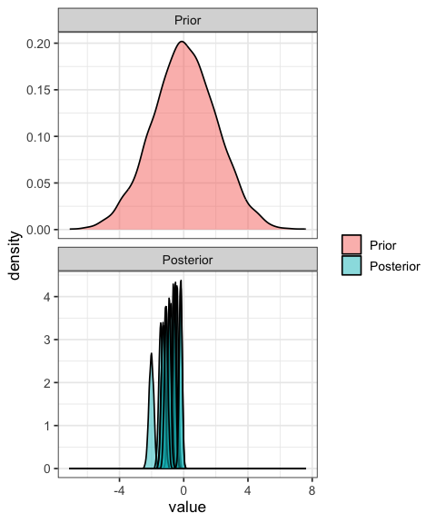
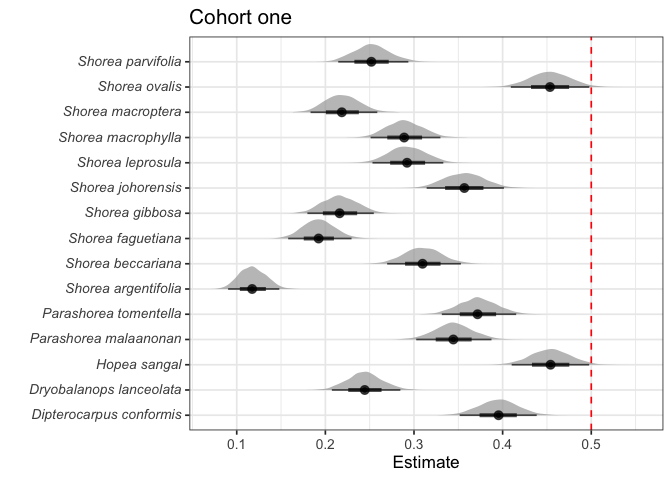
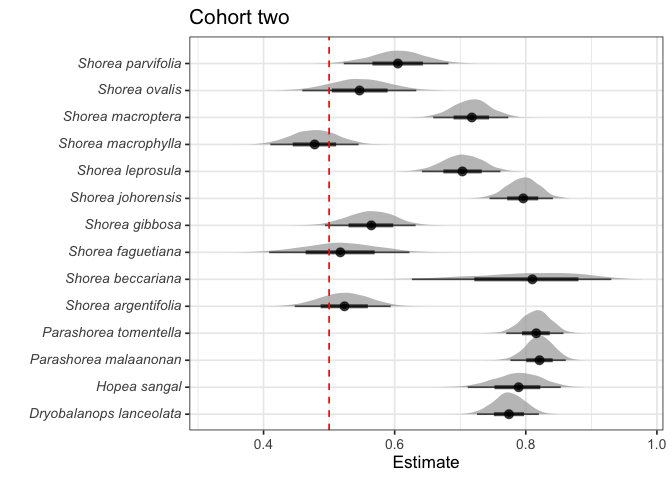
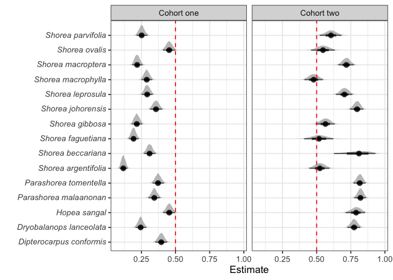

# Analysis of seedlings which were never recorded as alive
eleanorjackson
2025-10-28

- [First cohort](#first-cohort)
  - [Fit model](#fit-model)
  - [Check prior](#check-prior)
  - [Make figure of posterior](#make-figure-of-posterior)
- [Repeat for the second cohort](#repeat-for-the-second-cohort)
  - [Fit model](#fit-model-1)
  - [Make figure](#make-figure)
- [Combine figures](#combine-figures)

57% of individuals were never recorded as alive (5,869 out of 10,274),
i.e. they died in the period between planting and the first census. We
excluded these individuals from any further analysis since their
mortality is likely due to stress from transplanting rather than any
effect of forest type. This only occurs in the logged forest because in
the SBE seedlings were not censused on the day they were planted.

``` r
library("tidyverse")
library("tidybayes")
library("brms")
library("patchwork")
library("ggtext")
library("modelr")
library("ggdist")
```

``` r
left_censored <-
  readRDS(here::here("data", "derived", "data_cleaned.rds")) %>%
  filter(forest_type == "logged") %>% 
  group_by(plant_id) %>%
  summarise(n = sum(survival)) %>%
  filter(n == 0) %>%
  select(plant_id)

all <-
  readRDS(here::here("data", "derived", "data_cleaned.rds")) %>%
  filter(forest_type == "logged") %>% 
  distinct(plant_id)

# all 
nrow(distinct(
  readRDS(here::here("data", "derived", "data_cleaned.rds")), 
  plant_id))
```

    [1] 10272

``` r
# all logged
nrow(all)
```

    [1] 9968

``` r
# all logged left censored
nrow(left_censored)
```

    [1] 5868

Seedlings that were never recorded alive, when were they first censused?

``` r
never_alive <-
  readRDS(here::here("data", "derived", "data_cleaned.rds")) %>%
  filter(plant_id %in% left_censored$plant_id)

never_alive %>% 
  filter(forest_type == "logged") %>% 
  filter(first_survey == survey_date ) %>% 
  group_by(census_no, cohort) %>% 
  summarise(n())
```

    # A tibble: 2 × 3
    # Groups:   census_no [2]
      census_no cohort `n()`
      <fct>     <fct>  <int>
    1 01        1       5034
    2 06        2        834

# First cohort

``` r
data <-
  readRDS(here::here("data", "derived", "data_cleaned.rds")) %>% 
  filter(forest_type == "logged", cohort == "1") %>% 
  filter(census_no == "01")
```

``` r
data %>% 
  group_by(survival) %>% 
  summarise(n())
```

    # A tibble: 2 × 2
      survival `n()`
         <dbl> <int>
    1        0  5034
    2        1  2188

## Fit model

``` r
model_01 <- 
  brm(formula = survival ~ 0 + genus_species,
    data = data,
    family = bernoulli,
    prior = prior(normal(0, 2)),
    sample_prior = "yes",
    file_refit = "on_change",
    file = here::here("code",
                      "notebooks",
                      "models",
                      "2025-09-30_never-alive-seedlings",
                      "census-01-bernoulli-survival")
    )
```

``` r
model_01
```

     Family: bernoulli 
      Links: mu = logit 
    Formula: survival ~ 0 + genus_species 
       Data: data (Number of observations: 7222) 
      Draws: 4 chains, each with iter = 2000; warmup = 1000; thin = 1;
             total post-warmup draws = 4000

    Regression Coefficients:
                                         Estimate Est.Error l-95% CI u-95% CI Rhat
    genus_speciesDipterocarpus_conformis    -0.43      0.09    -0.61    -0.25 1.00
    genus_speciesDryobalanops_lanceolata    -1.13      0.11    -1.34    -0.92 1.00
    genus_speciesHopea_sangal               -0.18      0.09    -0.36    -0.01 1.00
    genus_speciesParashorea_malaanonan      -0.64      0.10    -0.84    -0.46 1.00
    genus_speciesParashorea_tomentella      -0.52      0.09    -0.70    -0.34 1.00
    genus_speciesShorea_argentifolia        -2.02      0.15    -2.31    -1.75 1.00
    genus_speciesShorea_beccariana          -0.80      0.10    -1.00    -0.61 1.00
    genus_speciesShorea_faguetiana          -1.44      0.12    -1.67    -1.21 1.00
    genus_speciesShorea_gibbosa             -1.29      0.12    -1.52    -1.07 1.00
    genus_speciesShorea_johorensis          -0.59      0.10    -0.78    -0.40 1.00
    genus_speciesShorea_leprosula           -0.88      0.10    -1.08    -0.69 1.00
    genus_speciesShorea_macrophylla         -0.90      0.10    -1.09    -0.71 1.00
    genus_speciesShorea_macroptera          -1.27      0.11    -1.49    -1.05 1.00
    genus_speciesShorea_ovalis              -0.19      0.09    -0.37    -0.01 1.00
    genus_speciesShorea_parvifolia          -1.09      0.11    -1.30    -0.88 1.00
                                         Bulk_ESS Tail_ESS
    genus_speciesDipterocarpus_conformis    10339     3037
    genus_speciesDryobalanops_lanceolata    11266     2470
    genus_speciesHopea_sangal               10344     2891
    genus_speciesParashorea_malaanonan       7629     2698
    genus_speciesParashorea_tomentella      11242     3001
    genus_speciesShorea_argentifolia        10723     2934
    genus_speciesShorea_beccariana           9481     2795
    genus_speciesShorea_faguetiana          10636     2981
    genus_speciesShorea_gibbosa              8970     2770
    genus_speciesShorea_johorensis          10130     3108
    genus_speciesShorea_leprosula           10273     3076
    genus_speciesShorea_macrophylla         11487     2932
    genus_speciesShorea_macroptera           9789     2763
    genus_speciesShorea_ovalis              11867     3368
    genus_speciesShorea_parvifolia           9439     2851

    Draws were sampled using sampling(NUTS). For each parameter, Bulk_ESS
    and Tail_ESS are effective sample size measures, and Rhat is the potential
    scale reduction factor on split chains (at convergence, Rhat = 1).

## Check prior

``` r
prior_draws <- 
  prior_draws(model_01) %>% 
  select(contains("b"))

post_draws <- 
  as_draws_df(model_01, variable = "^b_", regex = TRUE)

prior_post <- 
  bind_rows(prior = prior_draws, 
            posterior = post_draws,
            .id = "dist") %>% 
  pivot_longer(cols = contains("b")) 
```

``` r
prior_post %>% 
  mutate(dist = str_to_sentence(dist)) %>%
  mutate(dist = factor(dist, levels = c("Prior", "Posterior"))) %>%
  ggplot(aes(x = value, fill = dist, group = name)) +
  geom_density(alpha = 0.5) +
  facet_wrap(~dist, scales = "free_y", ncol = 1) +
  theme(legend.title = element_blank())
```



## Make figure of posterior

``` r
p1 <- 
  data %>% 
  modelr::data_grid(genus_species = unique(data$genus_species)) %>%
  tidybayes::add_epred_draws(object = model_01) %>% 
  mutate(genus_species = str_replace(genus_species, "_", " ")) %>%
  mutate(genus_species = paste0("<i>", genus_species, "</i>", sep = "")) %>%
  ggplot(aes(x = .epred, y = genus_species)) +
  ggdist::stat_halfeye(alpha = 0.7) +
  theme(axis.text.y = element_markdown()) +
  labs(x = "Estimate",
       y = "") +
  geom_vline(xintercept = 0.5, colour = "red", linetype = 2) +
  ggtitle("Cohort one")

p1
```



# Repeat for the second cohort

``` r
data_2 <-
  readRDS(here::here("data", "derived", "data_cleaned.rds")) %>% 
  filter(forest_type == "logged", cohort == "2") %>% 
  filter(census_no == "06")
```

``` r
data_2 %>% 
  group_by(survival) %>% 
  summarise(n())
```

    # A tibble: 2 × 2
      survival `n()`
         <dbl> <int>
    1        0   834
    2        1  1912

## Fit model

``` r
model_02 <- 
  brm(formula = survival ~ 0 + genus_species,
    data = data_2,
    family = bernoulli,
    prior = prior(normal(0, 2)),
    sample_prior = "yes",
    file_refit = "on_change",
    file = here::here("code",
                      "notebooks",
                      "models",
                      "2025-09-30_never-alive-seedlings",
                      "census-06-bernoulli-survival")
    )
```

``` r
model_02
```

     Family: bernoulli 
      Links: mu = logit 
    Formula: survival ~ 0 + genus_species 
       Data: data_2 (Number of observations: 2746) 
      Draws: 4 chains, each with iter = 2000; warmup = 1000; thin = 1;
             total post-warmup draws = 4000

    Regression Coefficients:
                                         Estimate Est.Error l-95% CI u-95% CI Rhat
    genus_speciesDryobalanops_lanceolata     1.24      0.14     0.97     1.52 1.00
    genus_speciesHopea_sangal                1.32      0.22     0.90     1.76 1.00
    genus_speciesParashorea_malaanonan       1.53      0.15     1.25     1.82 1.00
    genus_speciesParashorea_tomentella       1.49      0.15     1.21     1.79 1.00
    genus_speciesShorea_argentifolia         0.09      0.15    -0.21     0.38 1.00
    genus_speciesShorea_beccariana           1.48      0.54     0.52     2.59 1.00
    genus_speciesShorea_faguetiana           0.07      0.22    -0.37     0.50 1.00
    genus_speciesShorea_gibbosa              0.26      0.15    -0.03     0.54 1.00
    genus_speciesShorea_johorensis           1.36      0.15     1.07     1.67 1.00
    genus_speciesShorea_leprosula            0.87      0.14     0.58     1.16 1.00
    genus_speciesShorea_macrophylla         -0.09      0.14    -0.36     0.18 1.00
    genus_speciesShorea_macroptera           0.93      0.14     0.66     1.23 1.00
    genus_speciesShorea_ovalis               0.19      0.18    -0.16     0.54 1.00
    genus_speciesShorea_parvifolia           0.43      0.17     0.09     0.76 1.00
                                         Bulk_ESS Tail_ESS
    genus_speciesDryobalanops_lanceolata     9795     2799
    genus_speciesHopea_sangal               10546     2877
    genus_speciesParashorea_malaanonan       8988     2524
    genus_speciesParashorea_tomentella       8665     2682
    genus_speciesShorea_argentifolia         8904     3025
    genus_speciesShorea_beccariana           8285     2979
    genus_speciesShorea_faguetiana           8598     2608
    genus_speciesShorea_gibbosa             11537     2735
    genus_speciesShorea_johorensis           9824     2935
    genus_speciesShorea_leprosula            9555     2741
    genus_speciesShorea_macrophylla         11569     3187
    genus_speciesShorea_macroptera          10182     2818
    genus_speciesShorea_ovalis              12027     3118
    genus_speciesShorea_parvifolia           9454     2781

    Draws were sampled using sampling(NUTS). For each parameter, Bulk_ESS
    and Tail_ESS are effective sample size measures, and Rhat is the potential
    scale reduction factor on split chains (at convergence, Rhat = 1).

## Make figure

``` r
p2 <- 
  data_2 %>% 
  modelr::data_grid(genus_species = fct_drop(unique(data_2$genus_species))) %>%
  tidybayes::add_epred_draws(object = model_02) %>% 
  mutate(genus_species = str_replace(genus_species, "_", " ")) %>%
  mutate(genus_species = paste0("<i>", genus_species, "</i>", sep = "")) %>%
  ggplot(aes(x = .epred, y = genus_species)) +
  ggdist::stat_halfeye(alpha = 0.7) +
  theme(axis.text.y = element_markdown()) +
  labs(x = "Estimate",
       y = "") +
  geom_vline(xintercept = 0.5, colour = "red", linetype = 2) +
  ggtitle("Cohort two")

p2
```



# Combine figures

``` r
out_1 <- 
  data %>% 
  modelr::data_grid(genus_species = unique(data$genus_species)) %>%
  tidybayes::add_epred_draws(object = model_01) %>% 
  mutate(genus_species = str_replace(genus_species, "_", " ")) %>%
  mutate(genus_species = paste0("<i>", genus_species, "</i>", sep = ""))%>% 
  mutate(cohort = "Cohort one")

out_2 <-
  data_2 %>% 
  modelr::data_grid(genus_species = fct_drop(unique(data_2$genus_species))) %>%
  tidybayes::add_epred_draws(object = model_02) %>% 
  mutate(genus_species = str_replace(genus_species, "_", " ")) %>%
  mutate(genus_species = paste0("<i>", genus_species, "</i>", sep = "")) %>% 
  mutate(cohort = "Cohort two")

bind_rows(out_1, out_2) %>% 
  ggplot(aes(x = .epred, y = genus_species)) +
  ggdist::stat_halfeye(alpha = 0.7) +
  theme(axis.text.y = element_markdown()) +
  labs(x = "Estimate",
       y = "") +
  geom_vline(xintercept = 0.5, colour = "red", linetype = 2) +
  facet_wrap(~cohort)
```


