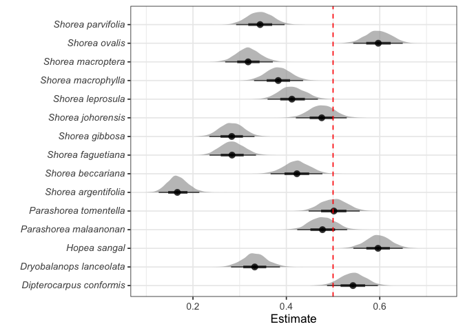
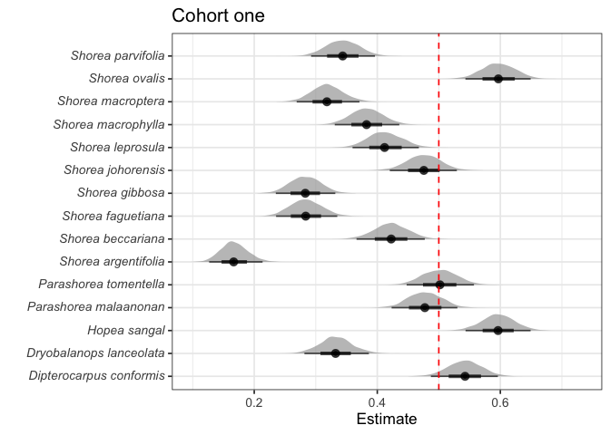
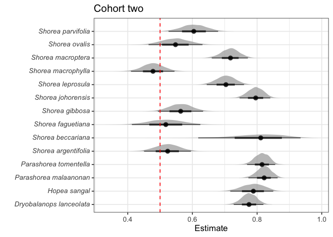
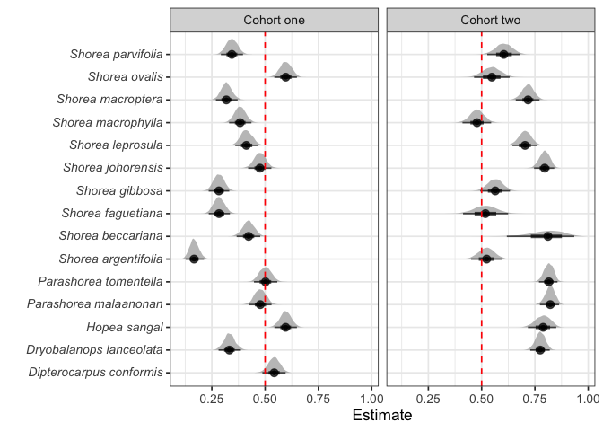

# Analysis of seedlings which were never recorded as alive
eleanorjackson
2025-10-27

- [Fit model](#fit-model)
- [Check prior](#check-prior)
- [Make figure of posterior](#make-figure-of-posterior)
- [Repeat for the second cohort](#repeat-for-the-second-cohort)
  - [Fit model](#fit-model-1)

57% of individuals were never recorded as alive (5,869 out of 10,274),
i.e. they died in the period between planting and the first census. We
excluded these individuals from any further analysis since their
mortality is likely due to stress from transplanting rather than any
effect of forest type. This only occurs in the logged forest because in
the SBE seedlings were not censused on the day they were planted.

``` r
library("tidyverse")
library("tidybayes")
library("brms")
library("patchwork")
library("ggtext")
library("modelr")
library("ggdist")
```

``` r
data <-
  readRDS(here::here("data", "derived", "data_cleaned.rds")) %>% 
  filter(forest_type == "logged") %>% 
  filter(census_no == "01")
```

``` r
data %>% 
  group_by(survival) %>% 
  summarise(n())
```

    # A tibble: 2 × 2
      survival `n()`
         <dbl> <int>
    1        0  2846
    2        1  2008

## Fit model

``` r
model_01 <- 
  brm(formula = survival ~ 0 + genus_species,
    data = data,
    family = bernoulli,
    prior = prior(normal(0, 2)),
    sample_prior = "yes",
    file_refit = "on_change",
    file = here::here("code",
                      "notebooks",
                      "models",
                      "2025-09-30_never-alive-seedlings",
                      "census-01-bernoulli-survival")
    )
```

``` r
model_01
```

     Family: bernoulli 
      Links: mu = logit 
    Formula: survival ~ 0 + genus_species 
       Data: data (Number of observations: 4854) 
      Draws: 4 chains, each with iter = 2000; warmup = 1000; thin = 1;
             total post-warmup draws = 4000

    Regression Coefficients:
                                         Estimate Est.Error l-95% CI u-95% CI Rhat
    genus_speciesDipterocarpus_conformis     0.17      0.11    -0.05     0.39 1.00
    genus_speciesDryobalanops_lanceolata    -0.70      0.12    -0.94    -0.46 1.00
    genus_speciesHopea_sangal                0.39      0.11     0.17     0.62 1.00
    genus_speciesParashorea_malaanonan      -0.09      0.11    -0.31     0.12 1.00
    genus_speciesParashorea_tomentella       0.01      0.11    -0.21     0.23 1.00
    genus_speciesShorea_argentifolia        -1.61      0.16    -1.93    -1.30 1.00
    genus_speciesShorea_beccariana          -0.31      0.11    -0.55    -0.09 1.00
    genus_speciesShorea_faguetiana          -0.93      0.13    -1.18    -0.69 1.00
    genus_speciesShorea_gibbosa             -0.93      0.12    -1.18    -0.70 1.00
    genus_speciesShorea_johorensis          -0.10      0.11    -0.32     0.12 1.00
    genus_speciesShorea_leprosula           -0.35      0.11    -0.58    -0.13 1.00
    genus_speciesShorea_macrophylla         -0.48      0.11    -0.70    -0.26 1.00
    genus_speciesShorea_macroptera          -0.76      0.12    -1.00    -0.53 1.00
    genus_speciesShorea_ovalis               0.39      0.11     0.17     0.62 1.00
    genus_speciesShorea_parvifolia          -0.65      0.12    -0.88    -0.42 1.00
                                         Bulk_ESS Tail_ESS
    genus_speciesDipterocarpus_conformis     9275     3143
    genus_speciesDryobalanops_lanceolata     9064     3187
    genus_speciesHopea_sangal                9653     2799
    genus_speciesParashorea_malaanonan       9517     2284
    genus_speciesParashorea_tomentella      10102     2434
    genus_speciesShorea_argentifolia         9904     2604
    genus_speciesShorea_beccariana           9626     2777
    genus_speciesShorea_faguetiana           9662     2958
    genus_speciesShorea_gibbosa              9473     2845
    genus_speciesShorea_johorensis           9713     2858
    genus_speciesShorea_leprosula           10061     2947
    genus_speciesShorea_macrophylla         10517     2803
    genus_speciesShorea_macroptera          11232     3094
    genus_speciesShorea_ovalis               9577     2973
    genus_speciesShorea_parvifolia           9347     3222

    Draws were sampled using sampling(NUTS). For each parameter, Bulk_ESS
    and Tail_ESS are effective sample size measures, and Rhat is the potential
    scale reduction factor on split chains (at convergence, Rhat = 1).

## Check prior

``` r
prior_draws <- 
  prior_draws(model_01) %>% 
  select(contains("b"))

post_draws <- 
  as_draws_df(model_01, variable = "^b_", regex = TRUE)

prior_post <- 
  bind_rows(prior = prior_draws, 
            posterior = post_draws,
            .id = "dist") %>% 
  pivot_longer(cols = contains("b")) 
```

``` r
prior_post %>% 
  mutate(dist = str_to_sentence(dist)) %>%
  mutate(dist = factor(dist, levels = c("Prior", "Posterior"))) %>%
  ggplot(aes(x = value, fill = dist, group = name)) +
  geom_density(alpha = 0.5) +
  facet_wrap(~dist, scales = "free_y", ncol = 1) +
  theme(legend.title = element_blank())
```



## Make figure of posterior

``` r
p1 <- 
  data %>% 
  modelr::data_grid(genus_species = unique(data$genus_species)) %>%
  tidybayes::add_epred_draws(object = model_01) %>% 
  mutate(genus_species = str_replace(genus_species, "_", " ")) %>%
  mutate(genus_species = paste0("<i>", genus_species, "</i>", sep = "")) %>%
  ggplot(aes(x = .epred, y = genus_species)) +
  ggdist::stat_halfeye(alpha = 0.7) +
  theme(axis.text.y = element_markdown()) +
  labs(x = "Estimate",
       y = "") +
  geom_vline(xintercept = 0.5, colour = "red", linetype = 2) +
  ggtitle("Cohort one")

p1
```



# Repeat for the second cohort

``` r
data_2 <-
  readRDS(here::here("data", "derived", "data_cleaned.rds")) %>% 
  filter(forest_type == "logged", cohort == "2") %>% 
  filter(census_no == "06")
```

``` r
data_2 %>% 
  group_by(survival) %>% 
  summarise(n())
```

    # A tibble: 2 × 2
      survival `n()`
         <dbl> <int>
    1        0   834
    2        1  1912

## Fit model

``` r
model_02 <- 
  brm(formula = survival ~ 0 + genus_species,
    data = data_2,
    family = bernoulli,
    prior = prior(normal(0, 2)),
    sample_prior = "yes",
    file_refit = "on_change",
    file = here::here("code",
                      "notebooks",
                      "models",
                      "2025-09-30_never-alive-seedlings",
                      "census-06-bernoulli-survival")
    )
```

``` r
model_02
```

     Family: bernoulli 
      Links: mu = logit 
    Formula: survival ~ 0 + genus_species 
       Data: data_2 (Number of observations: 2746) 
      Draws: 4 chains, each with iter = 2000; warmup = 1000; thin = 1;
             total post-warmup draws = 4000

    Regression Coefficients:
                                         Estimate Est.Error l-95% CI u-95% CI Rhat
    genus_speciesDryobalanops_lanceolata     1.24      0.13     0.98     1.51 1.00
    genus_speciesHopea_sangal                1.32      0.21     0.93     1.73 1.00
    genus_speciesParashorea_malaanonan       1.53      0.15     1.23     1.84 1.00
    genus_speciesParashorea_tomentella       1.49      0.15     1.20     1.78 1.00
    genus_speciesShorea_argentifolia         0.09      0.15    -0.20     0.39 1.00
    genus_speciesShorea_beccariana           1.48      0.54     0.48     2.66 1.00
    genus_speciesShorea_faguetiana           0.07      0.22    -0.35     0.51 1.01
    genus_speciesShorea_gibbosa              0.26      0.15    -0.03     0.55 1.00
    genus_speciesShorea_johorensis           1.36      0.15     1.08     1.66 1.00
    genus_speciesShorea_leprosula            0.87      0.14     0.59     1.15 1.00
    genus_speciesShorea_macrophylla         -0.09      0.14    -0.36     0.18 1.00
    genus_speciesShorea_macroptera           0.93      0.14     0.66     1.22 1.00
    genus_speciesShorea_ovalis               0.19      0.17    -0.14     0.54 1.00
    genus_speciesShorea_parvifolia           0.43      0.16     0.11     0.75 1.00
                                         Bulk_ESS Tail_ESS
    genus_speciesDryobalanops_lanceolata    10048     2868
    genus_speciesHopea_sangal                9552     3135
    genus_speciesParashorea_malaanonan       9632     3111
    genus_speciesParashorea_tomentella       8409     2351
    genus_speciesShorea_argentifolia         7756     3202
    genus_speciesShorea_beccariana           8545     2352
    genus_speciesShorea_faguetiana          12327     2716
    genus_speciesShorea_gibbosa              8921     2436
    genus_speciesShorea_johorensis           9351     2879
    genus_speciesShorea_leprosula            9679     3071
    genus_speciesShorea_macrophylla         10153     2586
    genus_speciesShorea_macroptera           9760     2993
    genus_speciesShorea_ovalis               9914     2967
    genus_speciesShorea_parvifolia           9032     2609

    Draws were sampled using sampling(NUTS). For each parameter, Bulk_ESS
    and Tail_ESS are effective sample size measures, and Rhat is the potential
    scale reduction factor on split chains (at convergence, Rhat = 1).

``` r
p2 <- 
  data_2 %>% 
  modelr::data_grid(genus_species = fct_drop(unique(data_2$genus_species))) %>%
  tidybayes::add_epred_draws(object = model_02) %>% 
  mutate(genus_species = str_replace(genus_species, "_", " ")) %>%
  mutate(genus_species = paste0("<i>", genus_species, "</i>", sep = "")) %>%
  ggplot(aes(x = .epred, y = genus_species)) +
  ggdist::stat_halfeye(alpha = 0.7) +
  theme(axis.text.y = element_markdown()) +
  labs(x = "Estimate",
       y = "") +
  geom_vline(xintercept = 0.5, colour = "red", linetype = 2) +
  ggtitle("Cohort two")

p2
```



``` r
out_1 <- 
  data %>% 
  modelr::data_grid(genus_species = unique(data$genus_species)) %>%
  tidybayes::add_epred_draws(object = model_01) %>% 
  mutate(genus_species = str_replace(genus_species, "_", " ")) %>%
  mutate(genus_species = paste0("<i>", genus_species, "</i>", sep = ""))%>% 
  mutate(cohort = "Cohort one")

out_2 <-
  data_2 %>% 
  modelr::data_grid(genus_species = fct_drop(unique(data_2$genus_species))) %>%
  tidybayes::add_epred_draws(object = model_02) %>% 
  mutate(genus_species = str_replace(genus_species, "_", " ")) %>%
  mutate(genus_species = paste0("<i>", genus_species, "</i>", sep = "")) %>% 
  mutate(cohort = "Cohort two")

bind_rows(out_1, out_2) %>% 
  ggplot(aes(x = .epred, y = genus_species)) +
  ggdist::stat_halfeye(alpha = 0.7) +
  theme(axis.text.y = element_markdown()) +
  labs(x = "Estimate",
       y = "") +
  geom_vline(xintercept = 0.5, colour = "red", linetype = 2) +
  facet_wrap(~cohort)
```


