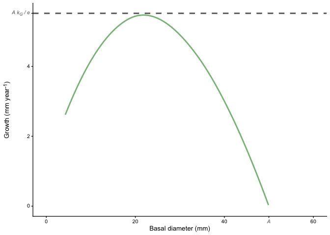
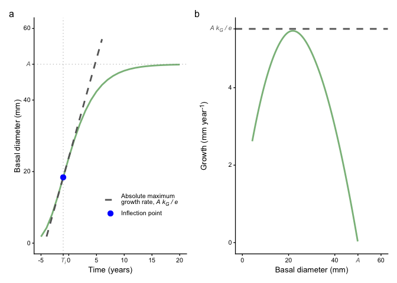

# Draw Gompertz
eleanorjackson
2025-12-15

``` r
library("tidyverse")
library("ggtext")
library("patchwork")
```

``` r
A <- 50 # Asymptotic maximum size
T_i <- -1 # Time at inflection point
k_G <- 0.3 # Growth rate parameter
```

``` r
gompertz <- function(t, A, k_G, T_i) {
  A * exp(-exp(- k_G * (t - T_i)))
}
```

``` r
# Calculate slope and intercept at inflection point
max_growth_rate <- A * k_G / exp(1)
size_at_Ti <- A / exp(1)
intercept <- size_at_Ti - max_growth_rate * T_i
```

``` r
# Create data frame with curve and tangent line
df <- tibble(
  t = seq(-5, 20, by = 1)
) %>%
  mutate(
    size = gompertz(t, A, k_G, T_i),
    tangent = max_growth_rate * t + intercept
  )

# Create inflection point data
inflection_point <- 
  tibble(
    t = T_i, 
    size = size_at_Ti
    )

# Plot
toy_fig <- 
  ggplot(df, aes(x = t)) +
  geom_line(
    aes(y = size, color = "Gompertz curve"),
    colour = "forestgreen",
    .width = 0,
    linewidth = 1,
    alpha = 0.6
  ) +
  geom_line(
    aes(y = tangent, 
        color = "Absolute maximum<br>growth rate, _A k<sub>G</sub> / e_"),
    linetype = "dashed",
    linewidth = 1
  ) +
  geom_point(data = inflection_point,
             aes(y = size, color = "Inflection point"),
             size = 3) +
  geom_vline(
    xintercept = T_i,
    linetype = "dotted",
    color = "gray50",
    alpha = 0.5
  ) +
  geom_hline(
    yintercept = A,
    linetype = "dotted",
    color = "gray50",
    alpha = 0.5
  ) +
  scale_color_manual(
    values = c(
      "Gompertz curve" = "forestgreen",
      "Absolute maximum<br>growth rate, _A k<sub>G</sub> / e_" = "gray40",
      "Inflection point" = "blue"
    ),
    breaks = c(
      "Gompertz curve",
      "Absolute maximum<br>growth rate, _A k<sub>G</sub> / e_",
      "Inflection point"
    )
  ) +
  labs(x = "Time (years)", y = "Basal diameter (mm)", color = NULL) +
  theme_classic(base_size = 10) +
  theme(
    legend.position = "inside",
    legend.position.inside = c(0.7, 0.2),
    axis.text.x = element_markdown(),
    axis.text.y = element_markdown(),
    legend.text = element_markdown()
  ) +
  scale_y_continuous(
    breaks = c(0, 20, 40, A, 60),
    labels = c(0, 20, 40, 
               "<span style = 'color:gray40;'>_A_</span>", 
               60),
    limits = c(0, 60)
  ) +
  scale_x_continuous(
    breaks = c(-5, T_i, 0, 5, 10, 15, 20),
    labels = c(-5, 
               "<span style = 'color:gray40;'>_T<sub>i</sub>_</span>", 
               0, 5, 10, 15, 20)
  )

toy_fig
```


``` r
jpeg(
  here::here("output", "plots", "gompertz.jpeg"),
  width = 80,
  height = 60,
  res = 600,
  pointsize = 6,
  units = "mm",
  type = "cairo"
)
toy_fig
dev.off()
```

    quartz_off_screen 
                    2 

``` r
# Print parameters
cat(
  "Parameters:\n",
  "A =", A, "\n",
  "k_G =", k_G, "\n",
  "T_i =", T_i, "\n\n",
  "At inflection point:\n",
  "Maximum absolute growth rate =", round(max_growth_rate, 3), "\n",
  "Size at T_i =", round(size_at_Ti, 3), "\n",
  "Tangent intercept =", round(intercept, 3), "\n"
  )
```

    Parameters:
     A = 50 
     k_G = 0.3 
     T_i = -1 

     At inflection point:
     Maximum absolute growth rate = 5.518 
     Size at T_i = 18.394 
     Tangent intercept = 23.912 

``` r
toy_fig2 <- 
  df %>% 
  mutate(lag_size = lag(size, n = 1, order_by = t)) %>%
  mutate(growth = size - lag_size) %>% 
  ggplot(aes(x = size, y = growth)) +
  geom_line(
    stat = "smooth",
    colour = "forestgreen",
    .width = 0,
    linewidth = 1,
    alpha = 0.6
  ) +
  geom_hline(
    yintercept = max_growth_rate,
    linetype = "dashed",
    color = "gray40",
    linewidth = 1
  ) +
  labs(x = "Basal diameter (mm)", y = "Growth (mm year<sup>-1</sup>)", color = NULL) +
  theme_classic(base_size = 10) +
  theme(
    axis.text.x = element_markdown(),
    axis.text.y = element_markdown(),
    axis.title.y = element_markdown()
  ) +
  scale_y_continuous(
    breaks = c(0, 2, 4, max_growth_rate),
    labels = c(0, 2, 4, 
                "<span style = 'color:gray40;'>_A k<sub>G</sub> / e_</span>"),
  ) +
  scale_x_continuous(
    breaks = c(0, 20, 40, A, 60),
    labels = c(0, 20, 40, 
               "<span style = 'color:gray40;'>_A_</span>", 
               60),
    limits = c(0, 60)
  ) 

toy_fig2
```



``` r
toy_fig + toy_fig2 +
  plot_annotation(tag_levels = "a")
```



``` r
jpeg(
  here::here("output", "figures", "figure_02.jpeg"),
  width = 80,
  height = 120,
  res = 600,
  pointsize = 6,
  units = "mm",
  type = "cairo"
)
toy_fig / 
  toy_fig2 +
  plot_annotation(tag_levels = "a")
dev.off()
```

    quartz_off_screen 
                    2 
