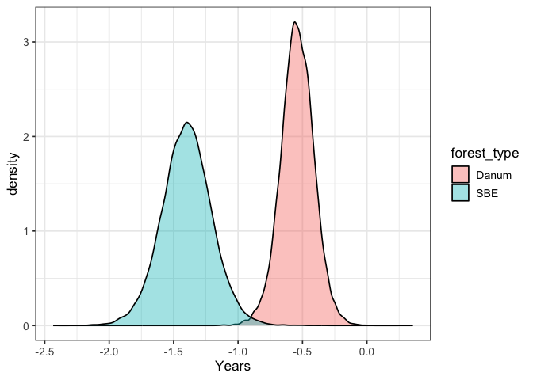

# Time to inflection of the growth curve
eleanorjackson
2025-12-08

Sometimes *Ti* is before the first measurement of the seedling in the
field.

``` r
library("tidyverse")
library("tidybayes")
library("brms")
library("modelr")
library("patchwork")
library("ggtext")
```

``` r
mod_gro <-
  readRDS(here::here("output", "models",
                     "growth_model_base_p3_allo.rds"))
```

``` r
data <-
  readRDS(here::here("data", "derived", "data_cleaned.rds"))

alive_trees <-
  data %>%
  filter(survival == 1) %>%
  filter(! if_all(c(dbh_mean, dbase_mean), is.na))

well_sampled_alive_trees <-
  alive_trees %>%
  group_by(plant_id) %>%
  summarise(n = n()) %>%
  filter(n > 2)

data_gro <-
  alive_trees %>%
  filter(plant_id %in% well_sampled_alive_trees$plant_id)
```

``` r
delay_ests <-
  gather_draws(
    model = mod_gro,
    b_delay_forest_typeprimary,
    b_delay_forest_typelogged) %>%
  mutate(forest_type = case_when(
    grepl("logged", .variable) ~ "SBE",
    grepl("primary", .variable) ~ "Danum")) 
```

``` r
ggplot(delay_ests,
       aes(x = .value, fill =forest_type)) +
  geom_density(alpha = 0.4) +
  xlab("Years")
```



``` r
delay_ests %>% 
  group_by(forest_type) %>% 
  summarise(median(.value))
```

    # A tibble: 2 × 2
      forest_type `median(.value)`
      <chr>                  <dbl>
    1 Danum                 -0.541
    2 SBE                   -1.40 

Time zero is the first survey for an individual seedling.

- For SBE cohort one, planting was between July 2002 and September 2003
  and first survey was between January 2004 and April 2004
- For SBE cohort two, planting was between January 2009 and October 2010
  and first survey was in May 2011
- For Danum seedlings, planting took place at the same time as
  censusing, between November 2004 and February 2005

For the first cohort of seedlings planted into SBE between 18 and 20
months elapsed between planting and censusing (i.e, 1.5 to 1.7 years).

For the second cohort between 7 and 28 months elapsed between planting
and censusing (i.e, 0.6 to 2.3 years).

So, our estimates of *Ti* (time to inflection of the growth curve) for
SBE seedlings fit within this range (-0.6 to -2.3).

Danum seedlings were censused at planting, but *Ti* is still negative -
suggests they reached max growth rates before planting into the field.
