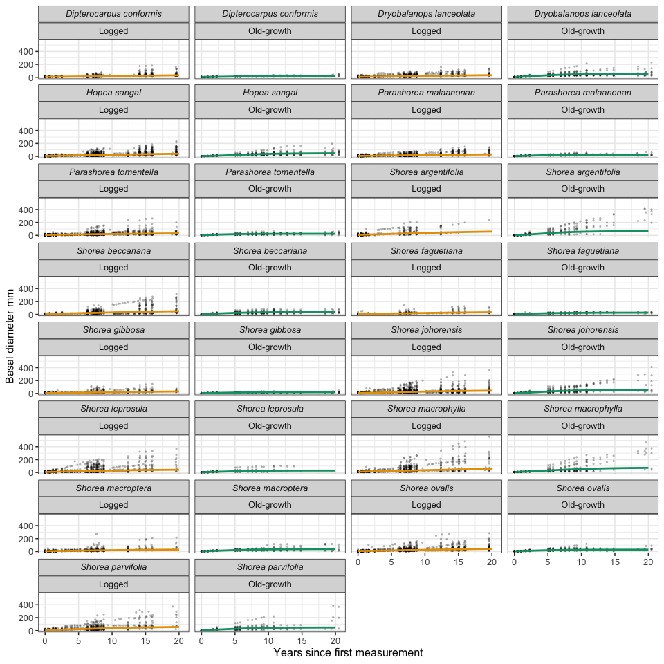
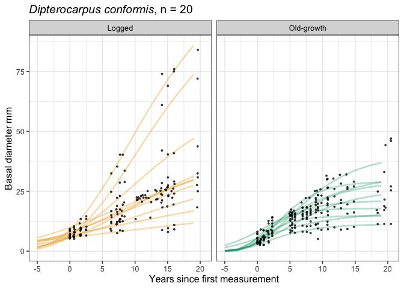
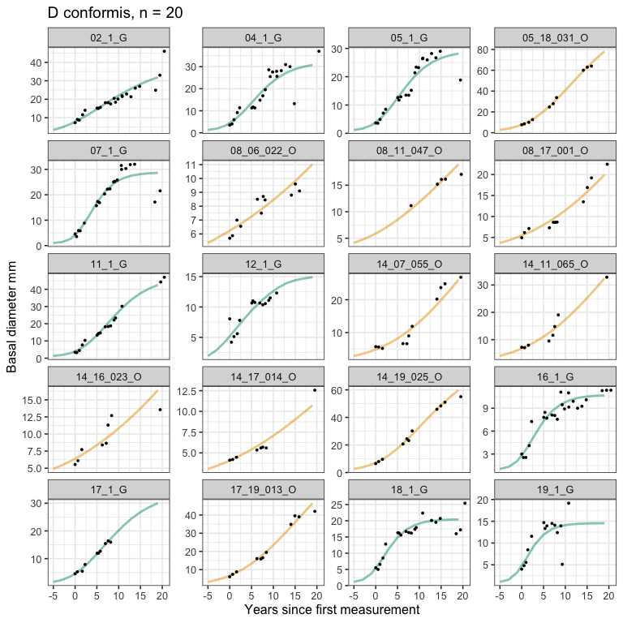

# Figures of growth curves with data points
eleanorjackson
2026-02-02

- [Tree level](#tree-level)

``` r
library("tidyverse")
library("tidybayes")
library("modelr")
library("ggtext")
library("ggview")
```

``` r
mod_gro <-
  readRDS(here::here("output", "models",
                     "growth_model.rds"))
```

``` r
data_gro <-
  mod_gro$data
```

``` r
preds_sp <- 
  data_grid(data_gro,
            genus_species,
            years = 0:20,
            forest_type = c("primary", "logged")) %>%
  add_epred_draws(mod_gro,
                  re_formula =
                    `log(A)` ~ 0 + forest_type|genus_species,
                    k ~ 0 + forest_type|genus_species,
                    delay ~ 0 + forest_type|genus_species) %>%
  mutate(forest_type_name = case_when(
      grepl("logged", forest_type) ~ "Logged",
      grepl("primary", forest_type) ~ "Old-growth")) %>%
  mutate(Species = str_replace(genus_species, "_", " ")) %>%
  mutate(Species = paste0("<i>", Species, "</i>", sep = ""))
```

``` r
data_gro <- 
  data_gro %>%
    mutate(forest_type_name = case_when(
      grepl("logged", forest_type) ~ "Logged",
      grepl("primary", forest_type) ~ "Old-growth")) %>%
  mutate(Species = str_replace(genus_species, "_", " ")) %>%
  mutate(Species = paste0("<i>", Species, "</i>", sep = ""))
```

``` r
pal <-
  c("Logged" = "#e69f00", "Old-growth" = "#009e73")

ggplot() +
  geom_point(data = data_gro,
             aes(x = years, y = dbase_mean),
             alpha = 0.3,
             shape = 16,
             size = 0.75,
             show.legend = FALSE) +
  stat_lineribbon(data = preds_sp,
                  aes(x = years, y = .epred, colour = forest_type_name),
                  .width = 0,
                  linewidth = 1,
                  show.legend = FALSE) +
  facet_wrap(Species~forest_type_name,
             ncol = 4) +
  scale_fill_manual(values = pal) +
  scale_colour_manual(values = pal) +
  labs(y = "Basal diameter mm",
       x = "Years since first measurement") +
  theme(strip.text = element_markdown()) 
```



``` r
p <- 
  ggplot() +
  geom_point(data = data_gro,
             aes(x = years, y = dbase_mean),
             alpha = 0.3,
             shape = 16,
             size = 0.75,
             show.legend = FALSE) +
  stat_lineribbon(data = preds_sp,
                  aes(x = years, y = .epred, colour = forest_type_name),
                  .width = 0,
                  linewidth = 1,
                  show.legend = FALSE) +
  facet_wrap(Species~forest_type_name,
             ncol = 4) +
  scale_fill_manual(values = pal) +
  scale_colour_manual(values = pal) +
  labs(y = "Basal diameter mm",
       x = "Years since first measurement") +
  theme(strip.text = element_markdown()) +
  ggview::canvas(18, 36, units = "cm")

ggview::save_ggplot(
  p, 
  file =
    paste0("figures/", 
           sub("\\.rmarkdown$", "", basename(file_name)), 
           "/", 
           "sp_preds.png", 
           sep = "")
  )
```

# Tree level

``` r
well_sampled <- 
  data_gro %>% 
  filter(genus_species == "Dipterocarpus_conformis") %>% 
  group_by(plant_id) %>% 
  summarise(n = n_distinct(years)) %>% 
  filter(n >10)

d_conformis_ids <- 
  data_gro %>% 
  filter(genus_species == "Dipterocarpus_conformis") %>% 
  filter(plant_id %in% well_sampled$plant_id) %>% 
  select(plant_id, forest_type) %>% 
  distinct() %>% 
  group_by(forest_type) %>% 
  sample_n(10) %>% 
  ungroup()

preds_d_conformis <- 
  data_grid(data_gro,
            genus_species = "Dipterocarpus_conformis",
            years = seq(-5,20,2),
            plant_id = droplevels(d_conformis_ids$plant_id)) %>%
  left_join(d_conformis_ids) %>% 
  mutate(plant_id = droplevels(plant_id)) %>% 
  add_epred_draws(mod_gro) %>%
  mutate(forest_type_name = case_when(
      grepl("logged", forest_type) ~ "Logged",
      grepl("primary", forest_type) ~ "Old-growth")) %>%
  mutate(Species = str_replace(genus_species, "_", " ")) %>%
  mutate(Species = paste0("<i>", Species, "</i>", sep = ""))
```

``` r
ggplot() +
  stat_lineribbon(data = preds_d_conformis,
                  aes(x = years, y = .epred, 
                      colour = forest_type_name, group = plant_id),
                  .width = 0,
                  alpha = 0.3,
                  linewidth = 1,
                  show.legend = FALSE) +
  geom_point(data = filter(data_gro, plant_id %in% d_conformis_ids$plant_id),
             aes(x = years, y = dbase_mean),
             shape = 16,
             size = 1,
             alpha = 0.8,
             show.legend = FALSE) +
  facet_wrap(~forest_type_name,
             ncol = 4) +
  scale_fill_manual(values = pal) +
  scale_colour_manual(values = pal) +
  labs(y = "Basal diameter mm",
       x = "Years since first measurement") +
  ggtitle("<i>Dipterocarpus conformis</i>, n = 20") +
  theme(plot.title = element_markdown()) 
```



``` r
ggplot() +
  stat_lineribbon(data = preds_d_conformis,
                  aes(x = years, y = .epred, 
                      colour = forest_type_name, group = plant_id),
                  .width = 0,
                  alpha = 0.5,
                  linewidth = 1,
                  show.legend = FALSE) +
  geom_point(data = filter(data_gro, plant_id %in% d_conformis_ids$plant_id),
             aes(x = years, y = dbase_mean),
             shape = 16,
             size = 1,
             show.legend = FALSE) +
  facet_wrap(~plant_id,
             ncol = 4, scales = "free_y") +
  scale_fill_manual(values = pal) +
  scale_colour_manual(values = pal) +
  labs(y = "Basal diameter mm",
       x = "Years since first measurement") +
  ggtitle("<i>Dipterocarpus conformis</i>, n = 20") +
  theme(plot.title = element_markdown()) 
```


