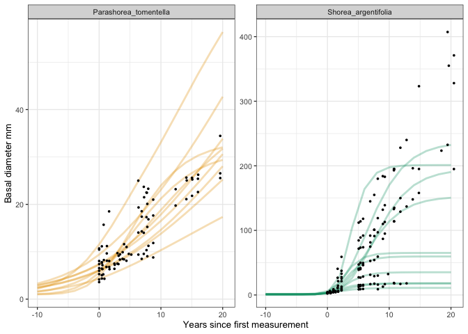
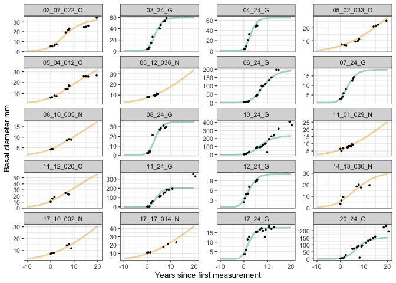
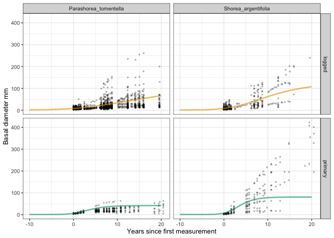
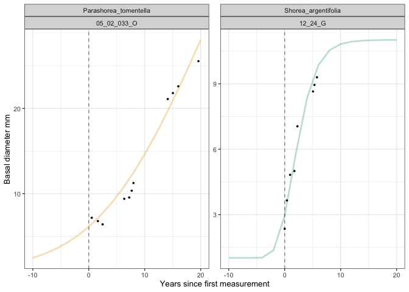

# Example fits of species with high and low *Ti* (delay)
eleanorjackson
2026-01-15

- [Individual level predictions](#individual-level-predictions)
- [Species level predictions](#species-level-predictions)
- [Make figure for SI](#make-figure-for-si)

``` r
library("tidyverse")
library("tidybayes")
library("modelr")
library("ggview")
```

``` r
mod_gro <-
  readRDS(here::here("output", "models",
                     "growth_model_base_p3_allo.rds"))
```

``` r
data <-
  readRDS(here::here("data", "derived", "data_cleaned.rds")) %>%
  filter(survival == 1)

well_sampled_trees <-
  data %>%
  group_by(plant_id) %>%
  summarise(records = sum(!is.na(dbase_mean))) %>%
  filter(records > 2)

data_gro <-
  data %>%
  filter(plant_id %in% well_sampled_trees$plant_id)
```

## Individual level predictions

*Parashorea tomentella* in the logged forest has the lowest *Ti* and
*Shorea argentifolia* in the old-growth forest has the highest *Ti*.

``` r
#negative Ti
well_sampled_ptom <- 
  data_gro %>% 
  filter(genus_species == "Parashorea_tomentella" & forest_type == "logged") %>% 
  group_by(plant_id, genus_species, forest_type) %>% 
  summarise(n = sum(survival)) %>% 
  filter(n >5)

# largest Ti
well_sampled_sarg <- 
  data_gro %>% 
  filter(genus_species == "Shorea_argentifolia" & forest_type == "primary") %>% 
  group_by(plant_id, genus_species, forest_type) %>% 
  summarise(n = sum(survival)) %>% 
  filter(n >5)

well_sampled_ids <- 
  rbind(well_sampled_ptom, well_sampled_sarg)

sample_ids <- 
  data_gro %>% 
  filter(plant_id %in% well_sampled_ids$plant_id) %>% 
  select(plant_id, genus_species, forest_type) %>% 
  distinct() %>% 
  group_by(genus_species, forest_type) %>% 
  sample_n(10) %>% 
  ungroup()

preds <- 
  data_grid(data_gro,
            years = seq(-10, 20, 2),
            plant_id = droplevels(sample_ids$plant_id)) %>%
  left_join(sample_ids, by = "plant_id") %>% 
  mutate(plant_id = droplevels(plant_id)) %>% 
  add_epred_draws(mod_gro) %>%
  mutate(forest_type_name = case_when(
      grepl("logged", forest_type) ~ "Logged",
      grepl("primary", forest_type) ~ "Old-growth")) 
```

``` r
pal <-
  c("Logged" = "#e69f00", "Old-growth" = "#009e73")
```

``` r
ggplot() +
  stat_lineribbon(data = preds,
                  aes(x = years, y = .epred, 
                      colour = as.factor(forest_type_name), 
                      group = plant_id),
                  .width = 0,
                  alpha = 0.3,
                  linewidth = 1,
                  show.legend = FALSE) +
  geom_point(data = filter(data_gro, plant_id %in% preds$plant_id),
             aes(x = years, y = dbase_mean),
             shape = 16,
             size = 1,
             show.legend = FALSE) +
  facet_wrap(~genus_species,
             scales = "free_y") +
  scale_colour_manual(values = pal) +
  labs(y = "Basal diameter mm",
       x = "Years since first measurement") 
```



Note different y-axis!

``` r
ggplot() +
  stat_lineribbon(data = preds,
                  aes(x = years, y = .epred, 
                      colour = as.factor(forest_type_name), 
                      group = plant_id),
                  .width = 0,
                  alpha = 0.4,
                  linewidth = 1,
                  show.legend = FALSE) +
  geom_point(data = filter(data_gro, plant_id %in% preds$plant_id),
             aes(x = years, y = dbase_mean),
             shape = 16,
             size = 1,
             show.legend = FALSE) +
  facet_wrap(~plant_id,
             ncol = 4,
             scales = "free_y") +
  scale_colour_manual(values = pal) +
  labs(y = "Basal diameter mm",
       x = "Years since first measurement") 
```



Looks like many of the *Shorea argentifolia* old-growth forest seedlings
here are being pulled down at their peak sizes, probably due to
partial-pooling, or our priors?

Let’s see if we can fit the Gompertz function to these seedlings
independent of all the other data.

``` r
oneplant <- 
  data_gro %>% 
  filter(plant_id == "11_24_G") %>% 
  drop_na(dbh_mean)
```

``` r
starting.values <- c(A = 300, k_G = 0.1, T_i = 0)

fit <- 
  nls(formula = "y ~ A * exp(-exp(- k_G * (t - T_i)))",
      data.frame(y = oneplant$dbh_mean, t = oneplant$years),
      starting.values)

fit
```

    Nonlinear regression model
      model: y ~ A * exp(-exp(-k_G * (t - T_i)))
       data: data.frame(y = oneplant$dbh_mean, t = oneplant$years)
           A      k_G      T_i 
    352.0641   0.1717   6.6923 
     residual sum-of-squares: 2205

    Number of iterations to convergence: 6 
    Achieved convergence tolerance: 7.076e-07

``` r
plot(oneplant$dbh_mean, ylab = "basal diameter", xlab = "years")
lines(oneplant$years, predict(fit))
```


Fits quite nicely.

## Species level predictions

``` r
preds_sp <- 
  data_grid(data_gro,
            genus_species = c("Parashorea_tomentella", "Shorea_argentifolia"),
            years = seq(-10, 20, 2),
            forest_type = c("logged", "primary")) %>%
  add_epred_draws(mod_gro,
                  re_formula =
                    `log(A)` ~ 0 + forest_type|genus_species,
                    k ~ 0 + forest_type|genus_species,
                    delay ~ 0 + forest_type|genus_species) %>% 
  mutate(forest_type_name = case_when(
      grepl("logged", forest_type) ~ "Logged",
      grepl("primary", forest_type) ~ "Old-growth")) 
```

``` r
ggplot() +
  geom_point(data = filter(data_gro, 
                           genus_species == "Parashorea_tomentella" |
                             genus_species == "Shorea_argentifolia"),
             aes(x = years, y = dbase_mean),
             shape = 16,
             size = 1,
             alpha = 0.3,
             show.legend = FALSE) +
  stat_lineribbon(data = preds_sp,
                  aes(x = years, y = .epred, 
                      colour = as.factor(forest_type_name), 
                      group = genus_species),
                  .width = 0,
                  alpha = 0.6,
                  linewidth = 1,
                  show.legend = FALSE) +
  facet_grid(forest_type~genus_species) +
  scale_colour_manual(values = pal) +
  labs(y = "Basal diameter mm",
       x = "Years since first measurement") 
```



I think that the *Shorea argentifolia* old-growth forest estimates are
being pulled down since the majority of *Shorea argentifolia* seedlings
across both forest types have lower basal diameters.

Although, I think I will try a more relaxed prior for *A*.

``` r
para_logged <- 
  preds %>% 
  filter(genus_species == "Parashorea_tomentella" & forest_type == "logged") %>% 
  group_by(years) %>% 
  point_interval(.epred, na.rm = TRUE)


nls(formula = "y ~ A * exp(-exp(- k_G * (t - T_i)))",
      data.frame(y = para_logged$.epred, t = para_logged$years),
      starting.values)
```

    Nonlinear regression model
      model: y ~ A * exp(-exp(-k_G * (t - T_i)))
       data: data.frame(y = para_logged$.epred, t = para_logged$years)
           A      k_G      T_i 
    60.27668  0.05946 12.91906 
     residual sum-of-squares: 3.216

    Number of iterations to convergence: 11 
    Achieved convergence tolerance: 8.859e-06

## Make figure for SI

``` r
one_shorea <- 
  preds %>% 
  filter(plant_id == "12_24_G") %>% 
  group_by(years) %>% 
  point_interval(.epred, na.rm = TRUE)


nls(formula = "y ~ A * exp(-exp(- k_G * (t - T_i)))",
      data.frame(y = one_shorea$.epred, t = one_shorea$years),
      starting.values)
```

    Nonlinear regression model
      model: y ~ A * exp(-exp(-k_G * (t - T_i)))
       data: data.frame(y = one_shorea$.epred, t = one_shorea$years)
          A     k_G     T_i 
    11.1600  0.3447  0.5793 
     residual sum-of-squares: 4.488

    Number of iterations to convergence: 15 
    Achieved convergence tolerance: 3.204e-06

``` r
one_parashorea <- 
  preds %>% 
  filter(plant_id == "05_02_033_O") %>% 
  group_by(years) %>% 
  point_interval(.epred, na.rm = TRUE)

starting.values <- c(A = 100, k_G = 0.1, T_i = 0)

nls(formula = "y ~ A * exp(-exp(- k_G * (t - T_i)))",
      data.frame(y = one_parashorea$.epred, t = one_parashorea$years),
      starting.values)
```

    Nonlinear regression model
      model: y ~ A * exp(-exp(-k_G * (t - T_i)))
       data: data.frame(y = one_parashorea$.epred, t = one_parashorea$years)
            A       k_G       T_i 
    321.16014   0.02409  56.86380 
     residual sum-of-squares: 0.3894

    Number of iterations to convergence: 23 
    Achieved convergence tolerance: 7.062e-06

Suggesting that this *P. tomentella* will only reach max growth rate
after 56 years… it is growing very slowly… maybe I need to relax the
priors for *Ti* too.

``` r
ggplot() +
  stat_lineribbon(data = filter(preds, 
                                plant_id %in% c("12_24_G", "05_02_033_O")),
                  aes(x = years, y = .epred, 
                      colour = as.factor(forest_type_name), 
                      group = plant_id),
                  .width = 0,
                  alpha = 0.3,
                  linewidth = 1,
                  show.legend = FALSE) +
  geom_point(data = filter(data_gro, 
                           plant_id %in% c("12_24_G", "05_02_033_O")),
             aes(x = years, y = dbase_mean),
             shape = 16,
             size = 1,
             show.legend = FALSE) +
  facet_wrap(genus_species~plant_id,
             ncol = 4,
             scales = "free_y") +
  scale_colour_manual(values = pal) +
  labs(y = "Basal diameter mm",
       x = "Years since first measurement") +
  geom_vline(xintercept = 0, linetype = 2, alpha = 0.5)
```


