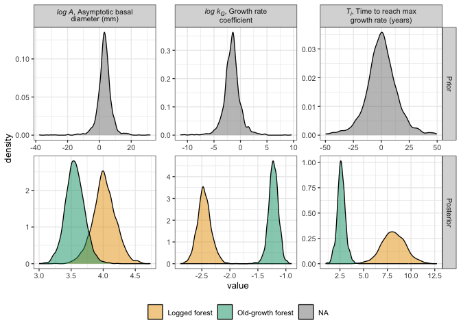
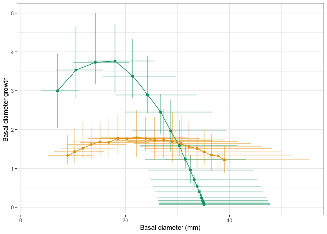
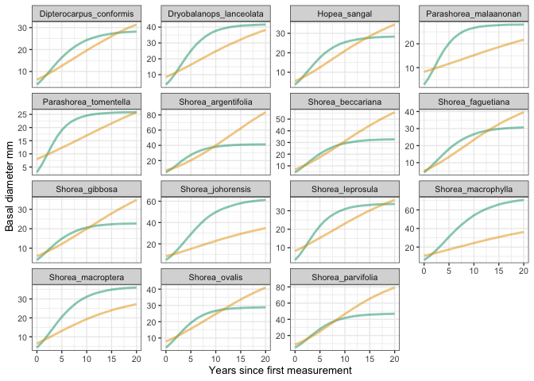

# Reparameterising the growth model
eleanorjackson
2026-01-22

- [Check priors](#check-priors)
- [Check forest type preds](#check-forest-type-preds)
- [Check species preds](#check-species-preds)
- [Check individual preds](#check-individual-preds)

`dbase_mean ~ A * exp(-exp(-kG * (years - Ti)))`

Is equation 1 in Tjørve & Tjørve (2017). To constrain `A` and `kG` to be
positive we use:

`dbase_mean ~ exp(logA) * exp(-exp(- exp(logkG) * (years - Ti)))`

and, with `family = lognormal()` brms interprets our nonlinear predictor
as mu on the log scale. Therefore, we write the Gompertz on the log
scale:

`dbase_mean ~ logA - exp(-(exp(logkG) * (years - Ti)))`

to predict `dbase_mean` on the response scale and give `A` and `kG` on
the response scale as `A = exp(logA)` and `kG = exp(logkG)`.

``` r
library("tidyverse")
library("tidybayes")
library("brms")
library("ggtext")
```

This is the new formula reparameterisation run on a **subset** of the
data.

``` r
mod_gro <-
  readRDS(here::here("output", "models",
                     "growth_model_base_p3_allo_priors5_sub.rds"))
```

``` r
summary(mod_gro)
```

     Family: lognormal 
      Links: mu = identity 
    Formula: dbase_mean ~ logA - exp(-(exp(logkG) * (years - Ti))) 
             logA ~ 0 + forest_type + (0 + forest_type | genus_species) + (1 | plant_id)
             logkG ~ 0 + forest_type + (0 + forest_type | genus_species) + (1 | plant_id)
             Ti ~ 0 + forest_type + (0 + forest_type | genus_species) + (1 | plant_id)
       Data: data_sample (Number of observations: 1939) 
      Draws: 4 chains, each with iter = 1000; warmup = 500; thin = 1;
             total post-warmup draws = 2000

    Multilevel Hyperparameters:
    ~genus_species (Number of levels: 15) 
                                                          Estimate Est.Error
    sd(logA_forest_typelogged)                                0.55      0.21
    sd(logA_forest_typeprimary)                               0.47      0.15
    sd(logkG_forest_typelogged)                               0.33      0.14
    sd(logkG_forest_typeprimary)                              0.25      0.11
    sd(Ti_forest_typelogged)                                  2.86      1.29
    sd(Ti_forest_typeprimary)                                 1.03      0.56
    cor(logA_forest_typelogged,logA_forest_typeprimary)       0.16      0.37
    cor(logkG_forest_typelogged,logkG_forest_typeprimary)    -0.33      0.40
    cor(Ti_forest_typelogged,Ti_forest_typeprimary)          -0.31      0.46
                                                          l-95% CI u-95% CI Rhat
    sd(logA_forest_typelogged)                                0.17     1.02 1.00
    sd(logA_forest_typeprimary)                               0.20     0.80 1.02
    sd(logkG_forest_typelogged)                               0.10     0.65 1.01
    sd(logkG_forest_typeprimary)                              0.05     0.50 1.01
    sd(Ti_forest_typelogged)                                  0.39     5.70 1.01
    sd(Ti_forest_typeprimary)                                 0.08     2.28 1.01
    cor(logA_forest_typelogged,logA_forest_typeprimary)      -0.56     0.82 1.00
    cor(logkG_forest_typelogged,logkG_forest_typeprimary)    -0.94     0.57 1.01
    cor(Ti_forest_typelogged,Ti_forest_typeprimary)          -0.96     0.71 1.01
                                                          Bulk_ESS Tail_ESS
    sd(logA_forest_typelogged)                                 341      358
    sd(logA_forest_typeprimary)                                422      637
    sd(logkG_forest_typelogged)                                461      480
    sd(logkG_forest_typeprimary)                               363      339
    sd(Ti_forest_typelogged)                                   277      308
    sd(Ti_forest_typeprimary)                                  220      451
    cor(logA_forest_typelogged,logA_forest_typeprimary)        351      731
    cor(logkG_forest_typelogged,logkG_forest_typeprimary)      770      873
    cor(Ti_forest_typelogged,Ti_forest_typeprimary)            574      787

    ~plant_id (Number of levels: 150) 
                        Estimate Est.Error l-95% CI u-95% CI Rhat Bulk_ESS Tail_ESS
    sd(logA_Intercept)      0.69      0.05     0.60     0.80 1.00      754      883
    sd(logkG_Intercept)     0.40      0.04     0.33     0.48 1.00      594      842
    sd(Ti_Intercept)        2.28      0.26     1.76     2.80 1.01      373      585

    Regression Coefficients:
                             Estimate Est.Error l-95% CI u-95% CI Rhat Bulk_ESS
    logA_forest_typelogged       4.02      0.18     3.65     4.38 1.00     1070
    logA_forest_typeprimary      3.56      0.15     3.27     3.86 1.00     1188
    logkG_forest_typelogged     -2.46      0.12    -2.70    -2.20 1.00     1025
    logkG_forest_typeprimary    -1.22      0.09    -1.40    -1.06 1.00     1196
    Ti_forest_typelogged         8.16      1.24     5.77    10.69 1.00     1127
    Ti_forest_typeprimary        2.64      0.43     1.77     3.57 1.01      818
                             Tail_ESS
    logA_forest_typelogged       1059
    logA_forest_typeprimary       840
    logkG_forest_typelogged      1365
    logkG_forest_typeprimary      845
    Ti_forest_typelogged         1408
    Ti_forest_typeprimary         823

    Further Distributional Parameters:
          Estimate Est.Error l-95% CI u-95% CI Rhat Bulk_ESS Tail_ESS
    sigma     0.15      0.00     0.15     0.16 1.00     1341     1216

    Draws were sampled using sampling(NUTS). For each parameter, Bulk_ESS
    and Tail_ESS are effective sample size measures, and Rhat is the potential
    scale reduction factor on split chains (at convergence, Rhat = 1).

## Check priors

``` r
prior_draws <- 
  prior_draws(mod_gro) %>% 
  select(contains("b_"))

post_draws <- 
  as_draws_df(mod_gro, variable = "^b_", regex = TRUE)

prior_post <- 
  bind_rows(prior = prior_draws, 
          posterior = post_draws,
          .id = "dist") %>% 
  pivot_longer(cols = contains("b_")) %>% 
  mutate(parameter = str_split_i(string = name, 
                                 pattern ="_", i = 2)) %>% 
  mutate(forest_type = case_when(
    grepl("logged", name) ~ "Logged forest",
    grepl("primary", name) ~ "Old-growth forest")) %>% 
  mutate(parameter = str_remove(string = parameter, 
                                 pattern ="logged")) %>% 
  mutate(parameter = str_remove(string = parameter, 
                                 pattern ="primary"))
```

``` r
pal <-
  c("Logged forest" = "#e69f00", "Old-growth forest" = "#009e73")

prior_post %>% 
  mutate(dist = str_to_sentence(dist)) %>%
  mutate(dist = factor(dist, levels = c("Prior", "Posterior"))) %>%
  mutate(name = case_when(
    parameter == "logA" ~ "<i>log A</i>, Asymptotic basal<br>diameter (mm)",
    parameter == "logkG" ~ "<i>log k<sub>G</sub></i>, Growth rate<br>coefficient",
    parameter == "Ti" ~ "<i>T<sub>i</sub></i>, Time to reach max<br>growth rate (years)"
  )) %>%
  mutate(value = case_when(
    parameter == "logA" ~ value,
    parameter == "logkG" ~ value,
    parameter == "Ti" ~ value
  )) %>%
  filter(value < 50) %>% 
  filter(value > -50) %>% 
  ggplot(aes(x = value, fill = forest_type)) +
  geom_density(alpha = 0.5) +
  ggh4x::facet_grid2(dist~name, scales = "free", independent = "all") +
  scale_fill_manual(values = pal) +
  theme(legend.position = "bottom",
        strip.text = element_markdown(),
        legend.title = element_blank())
```



## Check forest type preds

``` r
data_gro <-
  readRDS(here::here("data", "derived", "data_cleaned.rds")) %>%
  filter(survival == 1) %>%
  drop_na(dbase_mean)
```

``` r
# predicting diameter at 1 year time points
gro_epred <-
  data_gro %>%
  modelr::data_grid(years = c(0:20),
            forest_type) %>%
  add_epred_draws(mod_gro,
                  re_formula = NA)

# calculate growth rate
gro_rate_epred <-
  gro_epred %>%
  group_by(forest_type, years) %>%
  point_interval(.epred,
                 .width = 0.95,
                 .point = median,
                 .interval = qi,
                 na.rm = TRUE) %>%
  group_by(forest_type) %>%
  mutate(lag_epred = lag(.epred, n = 1, order_by = years),
         lag_epred_low = lag(.lower, n = 1, order_by = years),
         lag_epred_up = lag(.upper, n = 1, order_by = years)) %>%
  rowwise() %>%
  mutate(y_value = .epred - lag_epred,
         y_min = .lower - lag_epred_low,
         y_max = .upper - lag_epred_up) %>%
  ungroup() %>%
  rename(x_min = .lower,
         x_max = .upper,
         x_value = .epred) %>%
  mutate(type = "growth")
```

``` r
pal <-
  c("Logged" = "#e69f00", "Old-growth" = "#009e73")

gro_rate_epred %>%
    mutate(forest_type = case_when(
      grepl("logged", forest_type) ~ "Logged",
      grepl("primary", forest_type) ~ "Old-growth")) %>%
    ggplot(aes(x = x_value, y = y_value,
               xmin = x_min, xmax = x_max,
               ymin = y_min, ymax = y_max,
               colour = forest_type,
               fill = forest_type)) +
    geom_pointinterval(interval_alpha = 0.5, orientation = "y",
                       size = 0.5, show.legend = FALSE) +
    geom_pointinterval(interval_alpha = 0.5, orientation = "x",
                       size = 0.5, show.legend = FALSE) +
    geom_line(show.legend = FALSE) +
    scale_fill_manual(values = pal) +
    scale_colour_manual(values = pal) +
    labs(x = "Basal diameter (mm)",
         y = "Basal diameter growth")
```



## Check species preds

``` r
preds_sp <- 
  modelr::data_grid(data_gro, 
                    forest_type, genus_species,
                    years = c(0:20)) %>%
  add_epred_draws(mod_gro,
                  re_formula =
                    `log(A)` ~ 0 + forest_type|genus_species,
                    k ~ 0 + forest_type|genus_species,
                    delay ~ 0 + forest_type|genus_species) %>% 
  mutate(forest_type_name = case_when(
      grepl("logged", forest_type) ~ "Logged",
      grepl("primary", forest_type) ~ "Old-growth")) 
```

``` r
ggplot() +
  stat_lineribbon(data = preds_sp,
                  aes(x = years, y = .epred, 
                      colour = forest_type_name, group = forest_type),
                  .width = 0,
                  alpha = 0.5,
                  linewidth = 1,
                  show.legend = FALSE) +
  facet_wrap(~genus_species,
             ncol = 4, scales = "free_y") +
  scale_fill_manual(values = pal) +
  scale_colour_manual(values = pal) +
  labs(y = "Basal diameter mm",
       x = "Years since first measurement") 
```



## Check individual preds

``` r
plant_ids <-
  mod_gro$data %>% 
  select(plant_id, forest_type, genus_species) %>% 
  distinct()

preds_sp <- 
  modelr::data_grid(mod_gro$data,
                    plant_id,
                    years = seq(-5,20,2)) %>%
  left_join(plant_ids) %>% 
  mutate(plant_id = droplevels(plant_id)) %>% 
  add_epred_draws(mod_gro) %>% 
  mutate(forest_type_name = case_when(
      grepl("logged", forest_type) ~ "Logged",
      grepl("primary", forest_type) ~ "Old-growth")) 
```

``` r
ggplot() +
  stat_lineribbon(data = preds_sp,
                  aes(x = years, y = .epred, 
                      colour = forest_type_name, group = plant_id),
                  .width = 0,
                  alpha = 0.3,
                  linewidth = 1,
                  show.legend = FALSE) +
  geom_point(data = mod_gro$data,
             aes(x = years, y = dbase_mean),
             shape = 16,
             size = 1,
             alpha = 0.7,
             show.legend = FALSE) +
  facet_grid(genus_species~forest_type,
             scales = "free_y") +
  scale_fill_manual(values = pal) +
  scale_colour_manual(values = pal) +
  labs(y = "Basal diameter mm",
       x = "Years since first measurement") 
```


