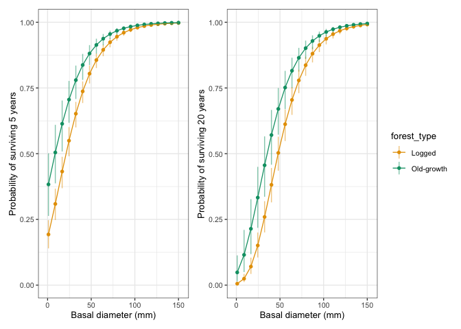
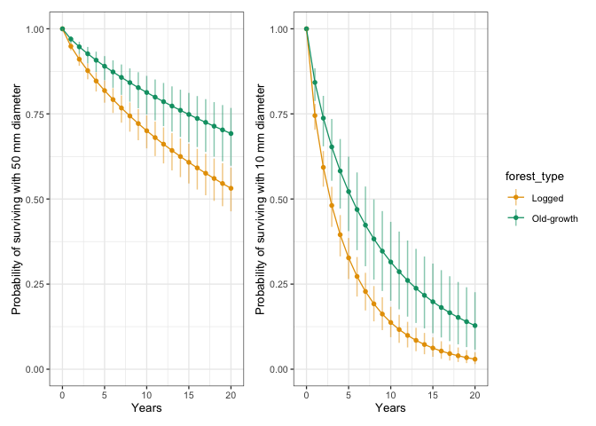

# Survival curves
eleanorjackson
2026-02-13

- [Survival ~ size](#survival--size)
- [Survival ~ time](#survival--time)

``` r
library("tidyverse")
library("tidybayes")
library("brms")
library("modelr")
library("patchwork")
library("ggtext")
```

``` r
mod_surv <-
  readRDS(here::here("output", "models",
                     "survival_model.rds"))

data_surv <- mod_surv$data
```

``` r
# Functions to scale and unscale basal diameter values
scale_basal <- function(x) {
  x / attr(data_surv$dbase_mean_sc, "scaled:scale")
}

unscale_basal <- function(x) {
  x*attr(data_surv$dbase_mean_sc, "scaled:scale")
}
```

``` r
my_sequence <-
  seq(
    from = min(data_surv$dbase_mean_sc, na.rm = T),
    to = scale_basal(150),
    length.out = 20)
```

``` r
surv_pred_20yrs <-
  data_surv %>%
  data_grid(dbase_mean_sc = my_sequence,
            forest_type = c("logged", "primary")) %>%
  add_linpred_draws(object = mod_surv, ndraws = NULL,
                    re_formula = NA, dpar = TRUE, transform = TRUE
  ) %>%
  rowwise() %>%
  mutate(scale = mu/gamma(1+(1/shape))) %>%
  mutate(surv = exp(-(20/scale)^shape)) %>% # survival to 20 yrs given size
  group_by(dbase_mean_sc, forest_type) %>%
  point_interval(surv,
                 .width = 0.95,
                 .point = median,
                 .interval = qi,
                 na.rm = TRUE) 
```

``` r
surv_pred_5yrs <-
  data_surv %>%
  data_grid(dbase_mean_sc = my_sequence,
            forest_type = c("logged", "primary")) %>%
  add_linpred_draws(object = mod_surv, ndraws = NULL,
                    re_formula = NA, dpar = TRUE, transform = TRUE
  ) %>%
  rowwise() %>%
  mutate(scale = mu/gamma(1+(1/shape))) %>%
  mutate(surv = exp(-(5/scale)^shape)) %>% # survival to 20 yrs given size
  group_by(dbase_mean_sc, forest_type) %>%
  point_interval(surv,
                 .width = 0.95,
                 .point = median,
                 .interval = qi,
                 na.rm = TRUE) 
```

``` r
pal <-
  c("Logged" = "#e69f00", "Old-growth" = "#009e73")
```

## Survival ~ size

``` r
surv_pred_5yrs %>%
    mutate(dbase_mean_sc = unscale_basal(dbase_mean_sc)) %>%
    mutate(forest_type = case_when(
      grepl("logged", forest_type) ~ "Logged",
      grepl("primary", forest_type) ~ "Old-growth")) %>%
    ggplot(aes(x = dbase_mean_sc, y = surv,
               ymin = .lower, ymax = .upper,
               colour = forest_type,
               fill = forest_type)) +
    geom_pointinterval(interval_alpha = 0.5, orientation = "x",
                       size = 0.5) +
    geom_line() +
    scale_fill_manual(values = pal) +
    scale_colour_manual(values = pal) +
    labs(x = "Basal diameter (mm)",
         y = "Probability of surviving 5 years") +
    ylim(0, 1) +
  
surv_pred_20yrs %>%
    mutate(dbase_mean_sc = unscale_basal(dbase_mean_sc)) %>%
    mutate(forest_type = case_when(
      grepl("logged", forest_type) ~ "Logged",
      grepl("primary", forest_type) ~ "Old-growth")) %>%
    ggplot(aes(x = dbase_mean_sc, y = surv,
               ymin = .lower, ymax = .upper,
               colour = forest_type,
               fill = forest_type)) +
    geom_pointinterval(interval_alpha = 0.5, orientation = "x",
                       size = 0.5) +
    geom_line() +
    scale_fill_manual(values = pal) +
    scale_colour_manual(values = pal) +
    labs(x = "Basal diameter (mm)",
         y = "Probability of surviving 20 years") +
    ylim(0, 1) +
  
  patchwork::plot_layout(guides = "collect")
```



## Survival ~ time

``` r
surv_pred_50mm <-
  data_surv %>%
  data_grid(dbase_mean_sc = scale_basal(50),
            years = c(0:20),
            forest_type = c("logged", "primary")) %>%
  add_linpred_draws(object = mod_surv, ndraws = NULL,
                    re_formula = NA, dpar = TRUE, transform = TRUE
  ) %>%
  rowwise() %>%
  mutate(scale = mu/gamma(1+(1/shape))) %>%
  mutate(surv = exp(-(years/scale)^shape)) %>%
  group_by(years, forest_type) %>%
  point_interval(surv,
                 .width = 0.95,
                 .point = median,
                 .interval = qi,
                 na.rm = TRUE) 
```

``` r
surv_pred_10mm <-
  data_surv %>%
  data_grid(dbase_mean_sc = scale_basal(10),
            years = c(0:20),
            forest_type = c("logged", "primary")) %>%
  add_linpred_draws(object = mod_surv, ndraws = NULL,
                    re_formula = NA, dpar = TRUE, transform = TRUE
  ) %>%
  rowwise() %>%
  mutate(scale = mu/gamma(1+(1/shape))) %>%
  mutate(surv = exp(-(years/scale)^shape)) %>% 
  group_by(years, forest_type) %>%
  point_interval(surv,
                 .width = 0.95,
                 .point = median,
                 .interval = qi,
                 na.rm = TRUE) 
```

``` r
surv_pred_50mm %>%
    mutate(forest_type = case_when(
      grepl("logged", forest_type) ~ "Logged",
      grepl("primary", forest_type) ~ "Old-growth")) %>%
    ggplot(aes(x = years, y = surv,
               ymin = .lower, ymax = .upper,
               colour = forest_type,
               fill = forest_type)) +
    geom_pointinterval(interval_alpha = 0.5, orientation = "x",
                       size = 0.5) +
    geom_line() +
    scale_fill_manual(values = pal) +
    scale_colour_manual(values = pal) +
    labs(x = "Years",
         y = "Probability of surviving with 50 mm diameter") +
    ylim(0, 1) +
  
  surv_pred_10mm %>%
    mutate(forest_type = case_when(
      grepl("logged", forest_type) ~ "Logged",
      grepl("primary", forest_type) ~ "Old-growth")) %>%
    ggplot(aes(x = years, y = surv,
               ymin = .lower, ymax = .upper,
               colour = forest_type,
               fill = forest_type)) +
    geom_pointinterval(interval_alpha = 0.5, orientation = "x",
                       size = 0.5) +
    geom_line() +
    scale_fill_manual(values = pal) +
    scale_colour_manual(values = pal) +
    labs(x = "Years",
         y = "Probability of surviving with 10 mm diameter") +
    ylim(0, 1) +
  
  patchwork::plot_layout(guides = "collect")
```


