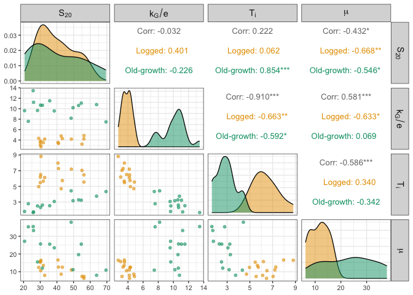

# Test for growth-survival trade-off in our model parameters
eleanorjackson
2026-05-27

``` r
# Packages ----------------------------------------------------------------

library("tidyverse")
library("tidybayes")
library("brms")
library("modelr")
```

``` r
# Get models --------------------------------------------------------------

mod_gro <-
  readRDS(here::here("output", "models",
                     "growth_model.rds"))

mod_surv <-
  readRDS(here::here("output", "models",
                     "survival_model.rds"))

names <-
  readr::read_csv(
    here::here(
      "data",
      "derived",
      "taxonomy.csv")) %>%
  select(genus_species.ORIG,
         scientificName,
         taxonID,
         scientificNameAuthorship) %>%
  mutate(Species = str_replace(genus_species.ORIG, " ", "_"))
```

``` r
# Get species-level estimates ---------------------------------------------

# A parameter
sp_ests_A <-
  mod_gro %>%
  spread_draws(
    b_logA_forest_typeprimary,
    b_logA_forest_typelogged,
    `r_genus_species__logA.*`, regex = TRUE) %>%
  rowwise() %>%
  mutate(across(contains(",forest_typeprimary]"),
                ~ .x + b_logA_forest_typeprimary)) %>%
  mutate(across(contains(",forest_typelogged]"),
                ~ .x + b_logA_forest_typelogged)) %>%
  ungroup() %>%
  pivot_longer(cols = contains("r_genus_species__logA")) %>%
  mutate(forest_type = case_when(
    grepl("logged", name) ~ "Logged",
    grepl("primary", name) ~ "Old-growth")) %>%
  mutate(Species = str_split_i(string = name, pattern ="\\[", i = 2)) %>%
  mutate(Species = str_split_i(string = Species, pattern =",", i = 1)) %>%
  mutate(parameter = "logA") %>%
  select(-c("b_logA_forest_typeprimary", "b_logA_forest_typelogged"))

# kG parameter
sp_ests_kG <-
  mod_gro %>%
  spread_draws(
    b_logkG_forest_typeprimary,
    b_logkG_forest_typelogged,
    `r_genus_species__logkG.*`, regex = TRUE) %>%
  rowwise() %>%
  mutate(across(contains(",forest_typeprimary]"),
                ~ .x + b_logkG_forest_typeprimary)) %>%
  mutate(across(contains(",forest_typelogged]"),
                ~ .x + b_logkG_forest_typelogged)) %>%
  ungroup() %>%
  pivot_longer(cols = contains("r_genus_species__logkG")) %>%
  mutate(forest_type = case_when(
    grepl("logged", name) ~ "Logged",
    grepl("primary", name) ~ "Old-growth")) %>%
  mutate(Species = str_split_i(string = name, pattern ="\\[", i = 2)) %>%
  mutate(Species = str_split_i(string = Species, pattern =",", i = 1)) %>%
  mutate(parameter = "logkG") %>%
  select(-c("b_logkG_forest_typeprimary", "b_logkG_forest_typelogged"))

# delay parameter
sp_ests_Ti <-
  mod_gro %>%
  spread_draws(
    b_Ti_forest_typeprimary,
    b_Ti_forest_typelogged,
    `r_genus_species__Ti.*`, regex = TRUE) %>%
  rowwise() %>%
  mutate(across(contains(",forest_typeprimary]"),
                ~ .x + b_Ti_forest_typeprimary)) %>%
  mutate(across(contains(",forest_typelogged]"),
                ~ .x + b_Ti_forest_typelogged)) %>%
  ungroup() %>%
  pivot_longer(cols = contains("r_genus_species__Ti")) %>%
  mutate(forest_type = case_when(
    grepl("logged", name) ~ "Logged",
    grepl("primary", name) ~ "Old-growth")) %>%
  mutate(Species = str_split_i(string = name, pattern ="\\[", i = 2)) %>%
  mutate(Species = str_split_i(string = Species, pattern =",", i = 1)) %>%
  mutate(parameter = "Ti") %>%
  select(-c("b_Ti_forest_typeprimary", "b_Ti_forest_typelogged"))

# survival
sp_ests_surv <-
  mod_surv %>%
  spread_draws(r_genus_species[genus_species,forest_type],
               b_forest_typelogged,
               b_forest_typeprimary, regex = TRUE) %>%
  mutate(value = case_when(forest_type == "forest_typeprimary" ~
                             r_genus_species + b_forest_typeprimary,
                           forest_type == "forest_typelogged" ~
                             r_genus_species + b_forest_typelogged)) %>%
  mutate(value = exp(value)) %>%
  mutate(forest_type = case_when(
    forest_type == "forest_typelogged" ~ "Logged",
    forest_type == "forest_typeprimary" ~ "Old-growth")) %>%
  rename(Species = genus_species) %>%
  mutate(parameter = "survival") %>%
  select(-c("b_forest_typelogged", "b_forest_typeprimary", "r_genus_species"))

# combine
sp_ests <-
  bind_rows(sp_ests_A,
            sp_ests_Ti,
            sp_ests_kG,
            sp_ests_surv) %>%
  select(.draw, forest_type, parameter, value, Species) %>%
  pivot_wider(names_from = parameter, values_from = value) %>%
  mutate(
    kG = exp(logkG),
    logS20 = logA - exp(-(kG * (20 - Ti))),
    S20 = exp(logS20),
    kG_e = (kG / exp(1)) * 100
  ) %>%
  select(.draw, forest_type, Species, S20, kG_e, Ti, survival) %>%
  pivot_longer(
    cols = c(S20, kG_e, Ti, survival),
    names_to = "parameter",
    values_to = ".value"
  ) %>%
  left_join(names) 
```

``` r
point_intervals <- 
  sp_ests %>% 
  select(.draw, forest_type, Species, parameter, .value) %>% 
  group_by(forest_type, Species, parameter) %>% 
  point_interval(
    .point = median,
    .interval = qi)
```

``` r
point_intervals_w <- 
  point_intervals %>% 
  select(-.interval, -.point, -.width) %>% 
  pivot_wider(
    names_from = "parameter", 
    values_from = ".value",
    id_cols = c(forest_type, Species))
```

``` r
GGally::ggpairs(
  point_intervals_w, 
  mapping = aes(colour = forest_type),
  columns = c("S20", "kG_e", "Ti", "survival"),
  columnLabels = c(
    "S[20]",
    "k[G] / e", 
    "T[i]", 
    "mu"),
  labeller = "label_parsed",
  progress = FALSE,
  diag = list(continuous = GGally::wrap("densityDiag", alpha = 0.5)),
  lower = list(continuous = GGally::wrap("points", alpha = 0.6))) +
  scale_fill_manual(values = c("#e69f00", "#009e73")) +
  scale_colour_manual(values = c("#e69f00", "#009e73")) +
  theme(strip.text = element_text(size = 11))
```


