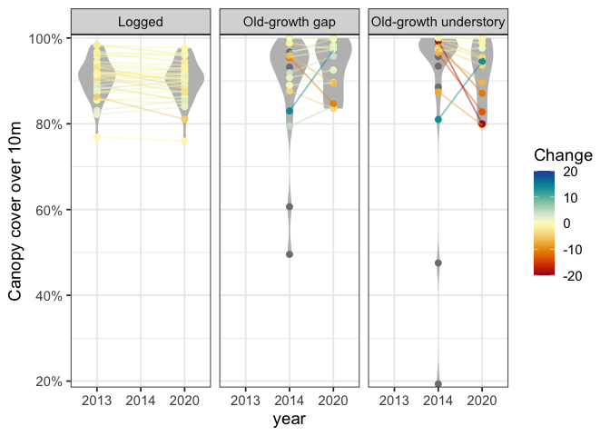
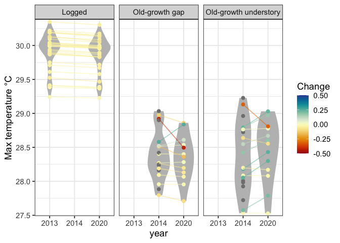
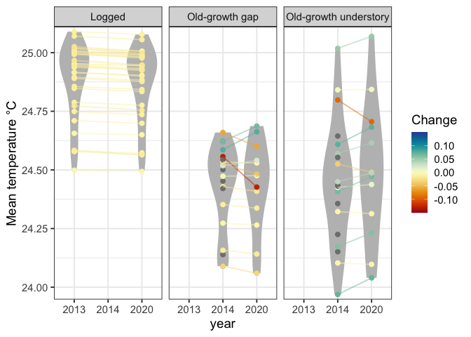

# Assess canopy cover in gaps - have they closed over time?
eleanorjackson
2026-05-15

- [Canopy cover](#canopy-cover)
- [Temp max](#temp-max)
- [Temp mean](#temp-mean)

``` r
library("tidyverse")
```

``` r
dv_data <- 
  read_csv(here::here("data", "raw", "Sabah_microclimate", 
                "Danum_gaps_with_canopy_and_microclimate.csv"))

sbe_data <- 
  read_csv(here::here("data", "raw", "Sabah_microclimate", 
                "SBE_plots_with_canopy_and_microclimate.csv"))
```

## Canopy cover

``` r
dv_canopy <- 
  dv_data %>% 
  filter(microclimate_source == "predicted") %>% 
  select(Plot, canopy_prop_over_10m, year) %>% 
  mutate(canopy = str_extract(Plot, "[A-Z]+" )) %>% 
  rename(plot = Plot) %>% 
  mutate(forest_type = "Old-growth",
         canopy = ifelse(canopy == "G", "gap", "understory"),
         plot = as.factor(plot)) %>% 
  mutate(forest_type = paste(forest_type, canopy, sep = " ")) %>% 
  select(plot, year, forest_type, canopy_prop_over_10m)
```

``` r
dv_data %>% 
  filter(microclimate_source == "predicted") %>% 
  group_by(Plot) %>% 
  summarise(n_distinct(year)) %>% 
  filter(`n_distinct(year)` < 2)
```

    # A tibble: 14 × 2
       Plot  `n_distinct(year)`
       <chr>              <int>
     1 2G                     1
     2 2U                     1
     3 3G                     1
     4 3U                     1
     5 4G                     1
     6 4U                     1
     7 5G                     1
     8 5U                     1
     9 6G                     1
    10 6U                     1
    11 7G                     1
    12 7U                     1
    13 8G                     1
    14 8U                     1

``` r
sbe_canopy <-
  sbe_data %>%
  mutate(canopy_prop_over_10m = canopy_prop_over_10m*100) %>% 
  filter(treatment == "16_spp") %>% 
  select(plot, canopy_prop_over_10m, year) %>% 
  select(plot, year, canopy_prop_over_10m) %>% 
  mutate(forest_type = "Logged",
         plot = as.factor(plot))
```

``` r
comb_data <- 
  bind_rows(dv_canopy, sbe_canopy) %>% 
  mutate(year = as.factor(year)) %>% 
  drop_na()
```

``` r
delta <-
  comb_data %>% 
  pivot_wider(names_from = "year",
              values_from = "canopy_prop_over_10m",
              id_cols = c("plot", "forest_type")) %>%
  mutate(Change = ifelse(
    forest_type == "Logged", `2020` - `2013`,
    `2020` - `2014`
  )) %>% 
  select(plot, forest_type, Change)
```

``` r
comb_data %>% 
  left_join(delta) %>% 
  ggplot(aes(x = year, y = canopy_prop_over_10m, 
             colour = Change)) +
  geom_violin(fill = "grey", colour = NA) +
  geom_point() +
  geom_line(aes(group = plot), alpha = 0.5) +
  facet_grid(~forest_type) +
  scale_colour_gradientn(colours = colorspace::divergingx_hcl(n = 20, palette = "RdYlBu"),
                           limits = c(-20, 20)) +
  ylab("Canopy cover over 10m") +
  scale_y_continuous(labels = scales::label_percent(scale = 1, accuracy = 1),
                     expand = c(0.01,0.01)) 
```



## Temp max

``` r
dv_tmax <- 
  dv_data %>% 
  filter(microclimate_source == "predicted") %>% 
  select(Plot, T_max, year) %>% 
  mutate(canopy = str_extract(Plot, "[A-Z]+" )) %>% 
  rename(plot = Plot) %>% 
  mutate(forest_type = "Old-growth",
         canopy = ifelse(canopy == "G", "gap", "understory"),
         plot = as.factor(plot)) %>% 
  mutate(forest_type = paste(forest_type, canopy, sep = " ")) %>% 
  select(plot, year, forest_type, T_max)
```

``` r
sbe_tmax <-
  sbe_data %>%
  filter(treatment == "16_spp") %>% 
  select(plot, T_max, year) %>% 
  select(plot, year, T_max) %>% 
  mutate(forest_type = "Logged",
         plot = as.factor(plot))
```

``` r
comb_data_tmax <- 
  bind_rows(dv_tmax, sbe_tmax) %>% 
  mutate(year = as.factor(year)) %>% 
  drop_na()
```

``` r
delta_tmax <-
  comb_data_tmax %>% 
  pivot_wider(names_from = "year",
              values_from = "T_max",
              id_cols = c("plot", "forest_type")) %>%
  mutate(Change = ifelse(
    forest_type == "Logged", `2020` - `2013`,
    `2020` - `2014`
  )) %>% 
  select(plot, forest_type, Change)
```

``` r
comb_data_tmax %>% 
  left_join(delta_tmax) %>% 
  ggplot(aes(x = year, y = T_max, 
             colour = Change)) +
  geom_violin(fill = "grey", colour = NA) +
  geom_point() +
  geom_line(aes(group = plot), alpha = 0.5) +
  facet_grid(~forest_type) +
  scale_colour_gradientn(colours = colorspace::divergingx_hcl(n = 20, palette = "RdYlBu"),
                           limits = c(-0.5, 0.5)) +
  ylab("Max temperature °C") +
  scale_y_continuous(expand = c(0.01,0.01)) 
```



## Temp mean

``` r
dv_tmean <- 
  dv_data %>% 
  filter(microclimate_source == "predicted") %>% 
  select(Plot, T_mean, year) %>% 
  mutate(canopy = str_extract(Plot, "[A-Z]+" )) %>% 
  rename(plot = Plot) %>% 
  mutate(forest_type = "Old-growth",
         canopy = ifelse(canopy == "G", "gap", "understory"),
         plot = as.factor(plot)) %>% 
  mutate(forest_type = paste(forest_type, canopy, sep = " ")) %>% 
  select(plot, year, forest_type, T_mean)
```

``` r
sbe_tmean <-
  sbe_data %>%
  filter(treatment == "16_spp") %>% 
  select(plot, T_mean, year) %>% 
  select(plot, year, T_mean) %>% 
  mutate(forest_type = "Logged",
         plot = as.factor(plot))
```

``` r
comb_data_tmean <- 
  bind_rows(dv_tmean, sbe_tmean) %>% 
  mutate(year = as.factor(year)) %>% 
  drop_na()
```

``` r
delta_tmean <-
  comb_data_tmean %>% 
  pivot_wider(names_from = "year",
              values_from = "T_mean",
              id_cols = c("plot", "forest_type")) %>%
  mutate(Change = ifelse(
    forest_type == "Logged", `2020` - `2013`,
    `2020` - `2014`
  )) %>% 
  select(plot, forest_type, Change)
```

``` r
comb_data_tmean %>% 
  left_join(delta_tmean) %>% 
  ggplot(aes(x = year, y = T_mean, 
             colour = Change)) +
  geom_violin(fill = "grey", colour = NA) +
  geom_point() +
  geom_line(aes(group = plot), alpha = 0.5) +
  facet_grid(~forest_type) +
  scale_colour_gradientn(colours = colorspace::divergingx_hcl(n = 20, palette = "RdYlBu"),
                           limits = c(-0.15, 0.15)) +
  ylab("Mean temperature °C") +
  scale_y_continuous(expand = c(0.01,0.01)) 
```


