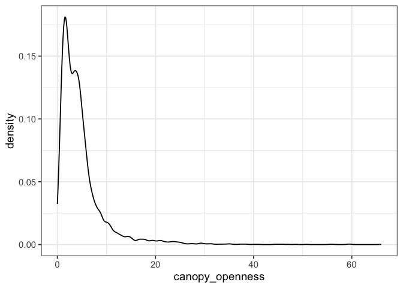
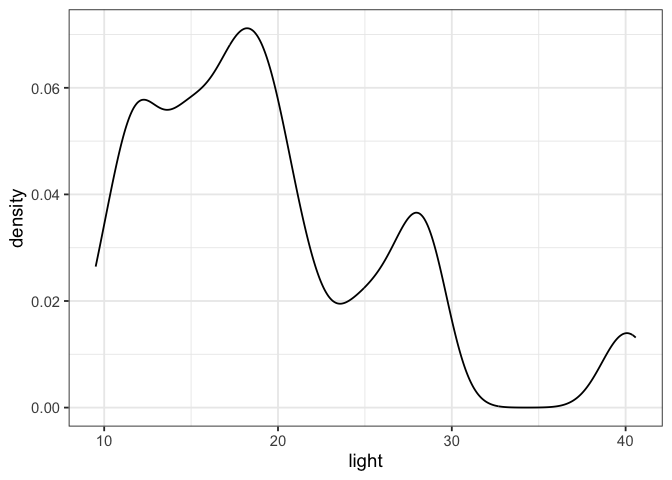
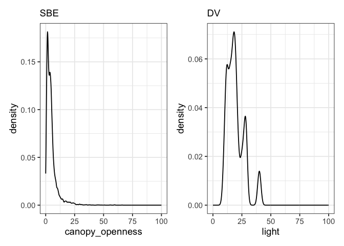

# Estimate canopy openness in the SBE vs DV
eleanorjackson
2026-05-28

- [SBE intensive plots](#sbe-intensive-plots)
- [DV gaps](#dv-gaps)
- [Compare](#compare)

``` r
library("tidyverse")
library("patchwork")
library("janitor")
```

## SBE intensive plots

``` r
data_sbe <-
  read_csv(
    here::here("data", "raw", "sbe", "SBE_compiled_data_2002-2024.csv")
  ) %>%
  clean_names() %>%
  rename(old_new = o_n,
         planting_date = plantingdate,
         survey_date = surveydate,
         height_apex = heightapex) %>%
  mutate(across(c(old_new, survival), str_trim)) %>%

  # Only intensively censused plots
  filter(pl %in% c(3, 5, 8, 11, 14, 17)) %>%

  mutate(plot = ifelse(is.na(pl), NA,
                       formatC(pl,
                               width = 2,
                               format = "d",
                               flag = "0")),
         line = ifelse(is.na(li), NA,
                       formatC(li,
                               width = 2,
                               format = "d",
                               flag = "0")),
         position = ifelse(is.na(po), NA,
                     formatC(po,
                             width = 3,
                             format = "d",
                             flag = "0")),
         sample = ifelse(is.na(sample), NA,
                       formatC(sample,
                               width = 2,
                               format = "d",
                               flag = "0"))
         ) %>%

  mutate(
    planting_date = dmy(planting_date),
    survey_date = dmy(survey_date),
    census_id = as.factor(paste(data_origin, sample, sep = "_")),
    plant_id = paste(plot, line, position, old_new, sep = "_"),
    survival = case_when(
      survival == "yes" ~ 1,
      survival == "no" ~ 0,
      .default = NA
    )
  ) %>%
  mutate(plant_id = case_when(
    is.na(position) ~ paste(plant_id, species, sep = "_"),
    .default = plant_id
  )) %>%
  # Making cols match the primary forest data
  mutate(plant_no = NA, forest_type = "logged", canopy = "C") %>%
  select(forest_type, plant_id, plot, canopy, line, position, old_new, plant_no,
         genus, species, genus_species,
         planting_date, census_id, survey_date,
         survival, height_apex, diam1, diam2, dbh1, dbh2,
         dn, ds, de, dw) %>% 
  drop_na(c(dn, ds, de, dw)) %>% 
  distinct() %>% 
  mutate(across(c(dn, ds, de, dw), ~ ifelse(.x >100, NA, .x)))
```

At the seedling level

``` r
data_sbe_one <-
  data_sbe %>%
  group_by(plant_id) %>%
  slice_min(survey_date, with_ties = FALSE) %>% 
  mutate(canopy_openness = mean(c(dn, de, ds, dw), na.rm = TRUE))
```

``` r
summary(data_sbe_one$canopy_openness)
```

       Min. 1st Qu.  Median    Mean 3rd Qu.    Max. 
      0.000   1.750   3.500   4.769   5.500  66.000 

At the plot level (seedling level values averaged per plot)

``` r
data_sbe_plot <-
  data_sbe_one %>%
  group_by(plot) %>%
  summarise(mean_canopy_openness = mean(canopy_openness, na.rm = TRUE)) 
```

``` r
summary(data_sbe_plot$mean_canopy_openness)
```

       Min. 1st Qu.  Median    Mean 3rd Qu.    Max. 
      3.960   4.217   4.412   4.797   4.668   7.094 

``` r
data_sbe_one %>% 
  ggplot(aes(x = canopy_openness)) +
  geom_density()
```



# DV gaps

``` r
data_dv <-
  read_delim(
    here::here("data", "raw", "download_zenodo", "DataGrowthSurvivalClean.txt")
  ) %>% 
  mutate(
    survey_date = dmy(Survey.date)) %>% 
  group_by(pid, Plant.id ) %>%
  slice_min(survey_date, with_ties = FALSE) %>% 
  filter(Canopy == "G")
```

``` r
summary(data_dv$light)
```

       Min. 1st Qu.  Median    Mean 3rd Qu.    Max. 
       9.51   14.48   17.93   19.29   22.35   40.58 

``` r
data_dv %>% 
  ggplot(aes(x = light)) +
  geom_density()
```



# Compare

``` r
data_sbe_one %>% 
  ggplot(aes(x = canopy_openness)) +
  geom_density() +
  xlim(0,100) +
  labs(subtitle = "SBE") +
  
  data_dv %>% 
  ggplot(aes(x = light)) +
  geom_density() +
  xlim(0,100) +
  labs(subtitle = "DV")
```


