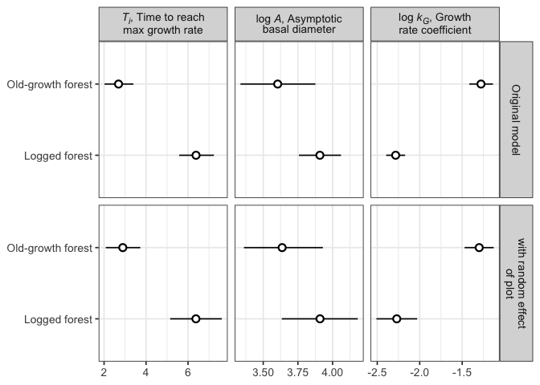
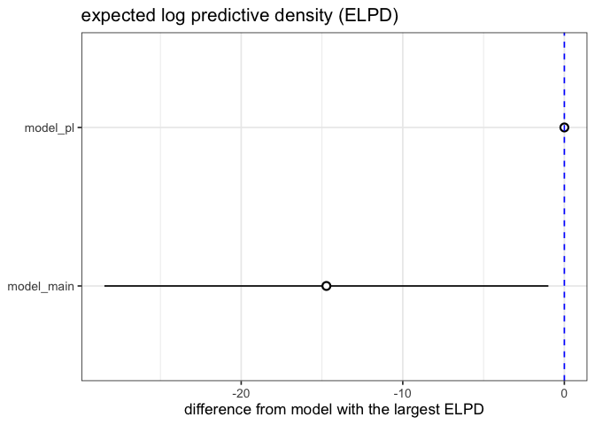
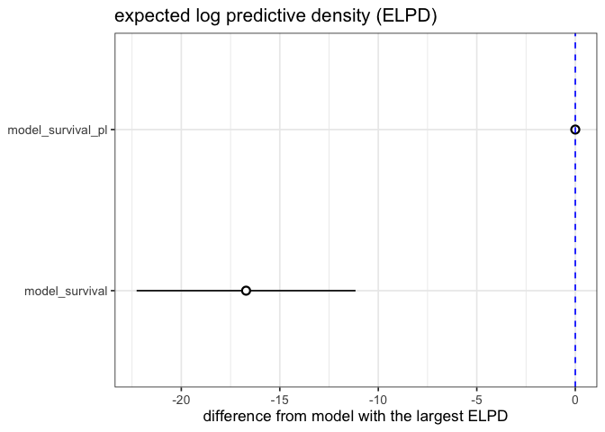
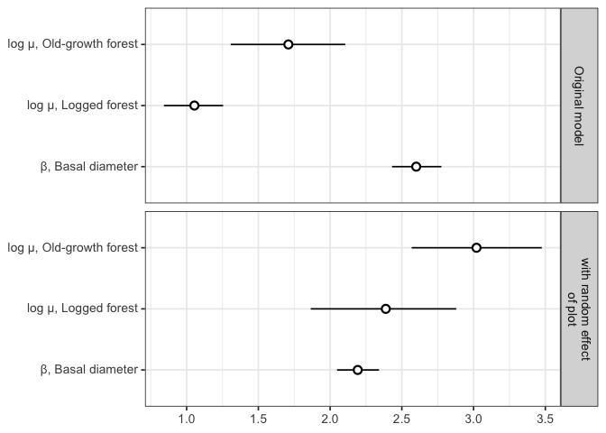

# Supplementary Information for including plot as a random effect
eleanorjackson
2026-05-23

- [Growth](#growth)
- [Survival](#survival)

``` r
library("tidyverse")
library("patchwork")
library("tidybayes")
library("brms")
library("modelr")
library("broom.mixed")
library("ggtext")
```

## Growth

``` r
model_pl <- 
  readRDS(here::here("output", 
                   "models",
                   "growth_model_plot.rds"))

model_main <- readRDS(here::here("output",
                                 "models",
                                 "growth_model.rds"))
```

``` r
model_pl$formula
```

    dbase_mean ~ logA - exp(-(exp(logkG) * (years - Ti))) 
    logA ~ 0 + forest_type + (0 + forest_type | genus_species) + (1 | plant_id) + (1 | forest_type:plot)
    logkG ~ 0 + forest_type + (0 + forest_type | genus_species) + (1 | plant_id) + (1 | forest_type:plot)
    Ti ~ 0 + forest_type + (0 + forest_type | genus_species) + (1 | plant_id) + (1 | forest_type:plot)

``` r
model_main$formula
```

    dbase_mean ~ logA - exp(-(exp(logkG) * (years - Ti))) 
    logA ~ 0 + forest_type + (0 + forest_type | genus_species) + (1 | plant_id)
    logkG ~ 0 + forest_type + (0 + forest_type | genus_species) + (1 | plant_id)
    Ti ~ 0 + forest_type + (0 + forest_type | genus_species) + (1 | plant_id)

``` r
my_coef_tab <- 
  tibble(fit = list(model_main, model_pl),
         model = c("Original model", 
                   "with random effect\nof plot")) %>%
  mutate(tidy = purrr::map(
    fit,
    broom.mixed::tidy,
    effect = "fixed")) %>% 
  select(-fit) %>% 
  unnest(tidy) %>% 
  filter(!grepl("prior", term)) %>% 
  filter(!grepl("cut", term)) %>% 
  rowwise() %>% 
  mutate(parameter = pluck(strsplit(term, "_"),1, 1)) %>% 
  mutate(forest_type = pluck(strsplit(term, "_"), 1, 3)) %>%
  mutate(forest_type = str_remove(forest_type, "type")) %>%
  mutate(forest_type =
           case_when(
             forest_type == "primary" ~ "Old-growth forest",
             forest_type == "logged" ~ "Logged forest",
             .default = forest_type
             )) %>% 
  mutate(name = case_when(
    parameter == "logA" ~ "log <i>A</i>, Asymptotic<br>basal diameter",
    parameter == "logkG" ~ "log <i>k<sub>G</sub></i>, Growth<br>rate coefficient",
    parameter == "Ti" ~ "<i>T<sub>i</sub></i>, Time to reach<br>max growth rate"
  ))
```

``` r
my_coef_tab %>% 
  ggplot(aes(x = forest_type, 
             y = estimate, 
             ymin = conf.low, ymax = conf.high)) +
  geom_pointrange(shape = 21, fill = "white") +
  labs(x = NULL,
       y = NULL) +
  coord_flip() +
  facet_grid(model~name, 
             scales = "free") +
  theme(strip.text = element_markdown())
```



``` r
loo_compare(model_main, model_pl) %>% 
  data.frame() %>% 
  rownames_to_column(var = "model_name") %>% 
  ggplot(aes(x    = reorder(model_name, elpd_diff), 
             y    = elpd_diff, 
             ymin = elpd_diff - se_diff, 
             ymax = elpd_diff + se_diff)) +
  geom_pointrange(shape = 21, fill = "white") +
  coord_flip() +
  geom_hline(yintercept = 0, colour = "blue", linetype = 2) +
  labs(x = NULL, y = "difference from model with the largest ELPD", 
       title = "expected log predictive density (ELPD)")  
```



## Survival

``` r
model_survival <-
  readRDS(here::here("output", "models",
                     "survival_model.rds"))
```

``` r
model_survival$formula
```

    time_to_last_alive | cens(x = censor, y2 = time_to_dead) ~ 0 + forest_type + dbase_mean_sc + (0 + forest_type | genus_species) 

``` r
model_survival_pl <-
  readRDS(here::here("output", "models",
                     "survival_model_plot.rds"))
```

``` r
model_survival_pl$formula
```

    time_to_last_alive | cens(x = censor, y2 = time_to_dead) ~ 0 + forest_type + dbase_mean_sc + (0 + forest_type | genus_species) + (1 | forest_type:plot) 

``` r
loo_compare(model_survival, model_survival_pl) %>% 
  data.frame() %>% 
  rownames_to_column(var = "model_name") %>% 
  ggplot(aes(x    = reorder(model_name, elpd_diff), 
             y    = elpd_diff, 
             ymin = elpd_diff - se_diff, 
             ymax = elpd_diff + se_diff)) +
  geom_pointrange(shape = 21, fill = "white") +
  coord_flip() +
  geom_hline(yintercept = 0, colour = "blue", linetype = 2) +
  labs(x = NULL, y = "difference from model with the largest ELPD", 
       title = "expected log predictive density (ELPD)")  
```



``` r
my_coef_tab_survival <- 
  tibble(fit = list(model_survival, model_survival_pl),
         model = c("Original model", 
                   "with random effect\nof plot")) %>%
  mutate(tidy = purrr::map(
    fit,
    broom.mixed::tidy,
    effect = "fixed")) %>% 
  select(-fit) %>% 
  unnest(tidy) %>% 
  filter(!grepl("prior", term)) %>% 
  rowwise() %>% 
  mutate(forest_type = pluck(strsplit(term, "_"), 1, 2)) %>%
  mutate(forest_type = str_remove(forest_type, "type")) %>% 
  mutate(forest_type =
           case_when(
             forest_type == "primary" ~ "log &mu;, Old-growth forest",
             forest_type == "logged" ~ "log &mu;, Logged forest",
             forest_type == "mean" ~ "&beta;, Basal diameter",
             .default = forest_type
             )) 
```

``` r
my_coef_tab_survival %>% 
  ggplot(aes(x = forest_type, 
             y = estimate, 
             ymin = conf.low, ymax = conf.high)) +
  geom_pointrange(shape = 21, fill = "white") +
  labs(x = NULL,
       y = NULL) +
  coord_flip() +
  facet_grid(rows = vars(model), 
             scales = "fixed") +
  theme(strip.text = element_markdown(),
        axis.text.y = element_markdown())
```



``` r
model_survival_pl
```

     Family: weibull 
      Links: mu = log 
    Formula: time_to_last_alive | cens(x = censor, y2 = time_to_dead) ~ 0 + forest_type + dbase_mean_sc + (0 + forest_type | genus_species) + (1 | forest_type:plot) 
       Data: data (Number of observations: 4390) 
      Draws: 4 chains, each with iter = 5000; warmup = 2500; thin = 1;
             total post-warmup draws = 10000

    Multilevel Hyperparameters:
    ~forest_type:plot (Number of levels: 26) 
                  Estimate Est.Error l-95% CI u-95% CI Rhat Bulk_ESS Tail_ESS
    sd(Intercept)     0.55      0.16     0.26     0.88 1.00     2353     2070

    ~genus_species (Number of levels: 15) 
                                              Estimate Est.Error l-95% CI u-95% CI
    sd(forest_typelogged)                         0.36      0.08     0.24     0.54
    sd(forest_typeprimary)                        0.60      0.17     0.33     0.99
    cor(forest_typelogged,forest_typeprimary)     0.81      0.16     0.39     0.99
                                              Rhat Bulk_ESS Tail_ESS
    sd(forest_typelogged)                     1.00     2669     4361
    sd(forest_typeprimary)                    1.00     4290     6501
    cor(forest_typelogged,forest_typeprimary) 1.00     4622     4951

    Regression Coefficients:
                       Estimate Est.Error l-95% CI u-95% CI Rhat Bulk_ESS Tail_ESS
    forest_typelogged      2.39      0.25     1.86     2.88 1.00     2024     3774
    forest_typeprimary     3.02      0.23     2.57     3.48 1.00     3371     5194
    dbase_mean_sc          2.19      0.08     2.05     2.34 1.00    14995     7828

    Further Distributional Parameters:
          Estimate Est.Error l-95% CI u-95% CI Rhat Bulk_ESS Tail_ESS
    shape     0.83      0.01     0.81     0.86 1.00    16632     7311

    Draws were sampled using sampling(NUTS). For each parameter, Bulk_ESS
    and Tail_ESS are effective sample size measures, and Rhat is the potential
    scale reduction factor on split chains (at convergence, Rhat = 1).
