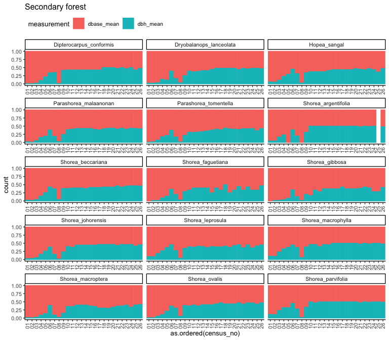

# Diameter conversion
eleanorjackson
2024-09-02

``` r
library("tidyverse")
library("here")
library("patchwork")
```

Some of the tree diameter measurements were taken at breast height
(1.3m), but others were taken at at base of the tree (5 cm from the
ground).

``` r
data <- 
  readRDS(here::here("data", "derived", "data_cleaned.rds"))
```

``` r
data %>% 
  ggplot(aes(x = dbase_mean)) +
  geom_histogram(binwidth = 2) +
  facet_wrap(~forest_type, scales = "free_y") +
  xlim(0, 50) +
  
  data %>% 
  ggplot(aes(x = dbh_mean)) +
  geom_histogram(binwidth = 2) +
  facet_wrap(~forest_type, scales = "free_y") +
  xlim(0, 50) +
  
  data %>% 
  ggplot(aes(x = height_apex)) +
  geom_histogram(binwidth = 5) +
  facet_wrap(~forest_type, scales = "free_y") +
  xlim(0, 500) +
  
  plot_layout(ncol = 1)
```


``` r
data %>% 
  filter(is.na(dbh_mean)) %>% 
  ggplot(aes(x = dbase_mean)) +
  geom_histogram(binwidth = 2) +
  facet_wrap(~forest_type, scales = "free_y") +
  xlim(0, 50) +
  
  data %>% 
  filter(is.na(dbase_mean)) %>% 
  ggplot(aes(x = dbh_mean)) +
  geom_histogram(binwidth = 2) +
  facet_wrap(~forest_type, scales = "free_y") +
  xlim(0, 50)  +
  
  plot_layout(ncol = 1) +
  plot_annotation(title = "Cases where either basal or BH diameter is NA")
```


From [Philipson *et al.* 2020](https://doi.org/10.1126/science.aay4490),
we can calculate diameter at breast height from our `dbase_mean`
measurements with this equation:

$$
diameter_{1.3m} = \frac{DBH_{POM}}{exp(-0.029(POM - 1.3))}
$$

They used this when the point of measurement (POM) had to be raised
above breast height (1.3m) due to buttress roots. I don’t know if this
applicable to our problem - our seedlings were too small for DBH to be
taken so the POM is below 1.3m.

Also.. I think this would need to be species specific, and we’d be
introducing a lot of error.

Perhaps if there is an approximate cut-off date for when trees are large
enough to be measured by DBH, we can split the data into early and late
growth and analyse separately. Seedling to sapling, and sapling to
adult? - different growth stages.

``` r
data %>% 
  pivot_longer(c(dbase_mean, dbh_mean), 
               names_to = "measurement", 
               values_to = "size") %>% 
  drop_na(size) %>% 
  ggplot(aes(x = as.ordered(census_no), 
             colour = measurement,
             fill = measurement)) +
  geom_bar() +
  facet_wrap(~forest_type, scales = "free_y", ncol = 1)
```


Let’s make the same figure but as proportions.

``` r
data %>% 
  pivot_longer(c(dbase_mean, dbh_mean), 
               names_to = "measurement", 
               values_to = "size") %>% 
  drop_na(size) %>% 
  ggplot(aes(x = as.ordered(census_no), 
             colour = measurement,
             fill = measurement)) +
  geom_bar(position = "fill") +
  facet_wrap(~forest_type, scales = "free_y", ncol = 1)
```


The SBE census 8 shows quite a big (proportional) drop in DBH
measurements?

From eyeballing it, from census 6 in the primary forest and census 10 in
the secondary forest, we seem to have a ~50:50 split in measurements. We
need to investigate whether these are duplicate measurements of the same
individual or half of the individuals being measured by DBH and the
other by basal diameter.

Species grow at different rates, so perhaps we’ll see differences there.

``` r
data %>% 
  filter(forest_type == "primary") %>% 
  pivot_longer(c(dbase_mean, dbh_mean), 
               names_to = "measurement", 
               values_to = "size") %>% 
  drop_na(size) %>% 
  ggplot(aes(x = as.ordered(census_no), 
             colour = measurement,
             fill = measurement)) +
  geom_bar(position = "fill") +
  facet_wrap(~genus_species, ncol = 3,
             axis.labels = "all_x", axes = "all_x") +
  ggtitle("Primary forest") +
  guides(x =  guide_axis(angle = 90)) +
  theme(legend.position = "top", legend.justification = "left")
```


Basal diameter measurements are used for longer in *D. conformis* and
*S. gibbosa*. They have 100% basal measurements till census 5/6, whereas
other sp. tend to only have 100% basal measurements till survey 3.

Draw again for the secondary forest seedlings.

``` r
data %>% 
  filter(forest_type == "secondary") %>% 
  pivot_longer(c(dbase_mean, dbh_mean), 
               names_to = "measurement", 
               values_to = "size") %>% 
  drop_na(size) %>% 
  ggplot(aes(x = as.ordered(census_no), 
             colour = measurement,
             fill = measurement)) +
  geom_bar(position = "fill") +
  facet_wrap(~genus_species, ncol = 3,
             axis.labels = "all_x", axes = "all_x") +
  ggtitle("Secondary forest") +
  guides(x =  guide_axis(angle = 90)) +
  theme(legend.position = "top", legend.justification = "left")
```



I’m not really seeing that same pattern in the SBE data - fairly similar
across species?
