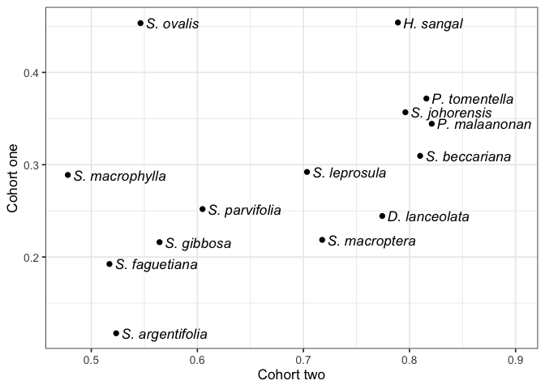
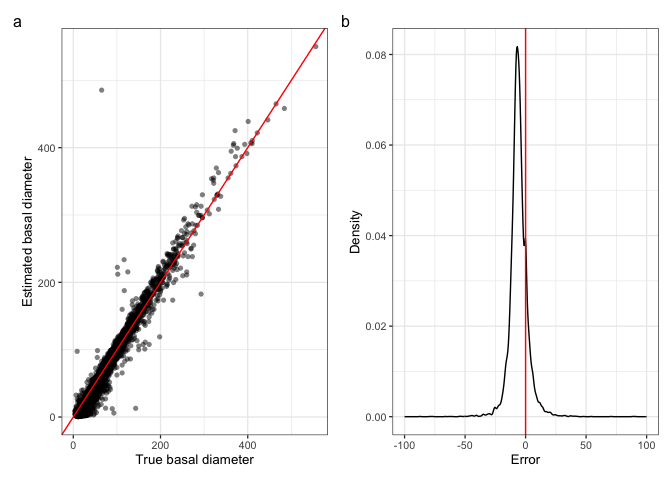
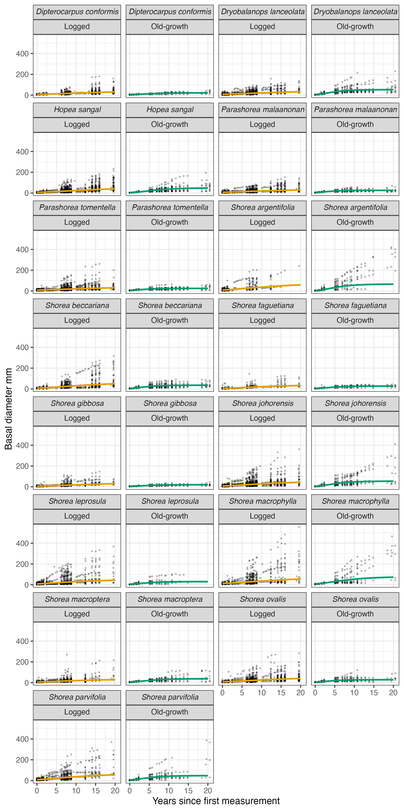
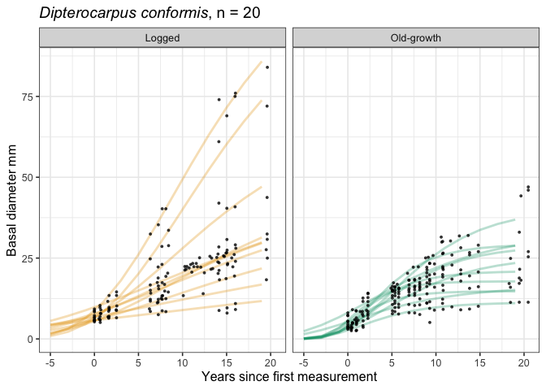
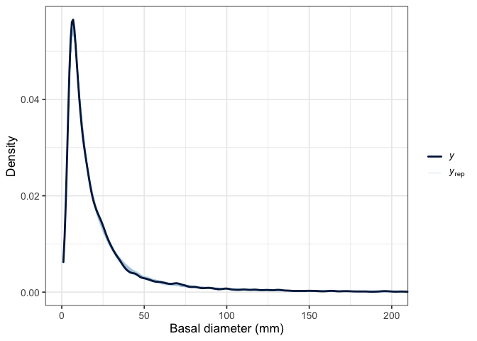



```{r}
library("tidyverse")
```

# Climber cutting

Three of the Sabah Biodiversity Experiment plots included in this study received 
a complete climber cutting treatment as part of a different experiment (plots numbered 5, 11 and 14), 
where all lianas $\ge$ 10 cm in height were cut at the base in 2011 and 2014. ^[O’Brien, M. J. et al. Positive effects of liana cutting on seedlings are reduced during El Niño-induced drought. Journal of Applied Ecology 56, 891–901 (2019). doi: [10.1111/1365-2664.13335](https://doi.org/10.1111/1365-2664.13335)]

Including the climber cutting treatment as a fixed effect in our growth and survival models
did not change our results.

{#fig-climber-cutting-gro width=400}


{#fig-climber-cutting-surv width=400}


# Species taxonomy

In the main text we use current accepted species names. Here, for reference, we list the old names, which are consistent with prior publications involving the Sabah Biodiversity Experiment. Species names were matched to a static copy of [The World Flora Online (WFO)](http://www.worldfloraonline.org)  v.2024.12 [zenodo.14538251](https://doi.org/10.5281/zenodo.14538251) using the function `WFO.match` from the R package {WorldFlora}. The function `WFO.one` was then used to find one unique matching name for each submitted name. Using the argument `priority = "Accepted"`, it first limits candidates to accepted names, with a possible second step of eliminating accepted names that are synonyms.

```{r}
#| label: tab-species
#| tbl-cap: "Taxonomy of species included in the study"

readr::read_csv(
        here::here(
          "data",
          "derived",
          "taxonomy.csv")) |>
  select(genus_species.ORIG,
         scientificName,
         taxonID,
         scientificNameAuthorship) |>
  rename("Original name" = genus_species.ORIG,
         "New accepted name" = scientificName,
         "WFO ID" = taxonID,
         "Authorship" = scientificNameAuthorship) |>
  arrange(`Original name`) |>
  knitr::kable()
```


# Survival analysis of logged forest seedlings in their first census

57% of all individuals were never recorded as alive (5,868 out of 10,272) 
i.e., they died in the period between planting and their first census. 
This occurs exclusively in the logged forest 
since unlike in the old-growth forest, 
diameter measurements were not taken at the time of planting. 

We excluded these individuals from the main analysis since they 
lack data both on size and exact age, 
hence the seedlings cannot be directly compared.
For the first cohort of seedlings planted into the logged forest, 
between 18 and 20 months elapsed between planting and censusing, 
in that time 70% of seedlings died (5,034 out of 7,222).
For the second cohort (replacing dead seedlings from cohort one), 
between 7 and 28 months elapsed between planting and censusing, and
30% died (834 out of 2,746).

Nevertheless, this data might provide some insight on which species are more likely to survive over these time periods, 
and we present a simple analysis here.

Survival of seedlings from cohort one and two were assessed in separate models with identical formulae.
We fit the models in the `R` package `brms` 
with a Bernoulli response distribution, 
where zero indicated the seedling was dead in it's first census and one indicated it was alive. 
The predictor was a fixed effect of species. 
We use a regularising prior of `normal(0, 2)`, a common choice for Bernoulli models. 
Results are presented in @fig-cens1-surv and @fig-cens1-corrsurv. 

{#fig-cens1-surv width=400}

{#fig-cens1-corrsurv width=400}

# Estimating missing values of basal diameter

There are 190 missing values of basal diameter in our data (0.73% of all records for living trees). For these missing values, we estimated basal diameter from diameter at breast height using a known allometric equation, ^[Cushman, K. C. et al. Improving estimates of biomass change in buttressed trees using tree taper models. Methods in Ecology and Evolution 5, 573–582 (2014). doi: [10.1111/2041-210X.12187](https://doi.org/10.1111/2041-210X.12187)]

$$
d_{h2} = \frac{D_{h1}}{exp(b_1 h1 - h2)}
$$

where $d_{h2}$ is the estimated diameter (mm) at height $h_2$ (m),
$D_{h1}$ is the known diameter (mm) at height $h_1$ (m), 
and $b_1$ is a taper parameter.

We chose the value for our taper parameter $b_1 = 3.91$ by 
optimising on trees where we had diameter measurements both at the base and at 
breast height, to find the value which gave the lowest Root Mean Squared Error.

{#fig-est-basal width=400}

# Prior choice

{#fig-prior-gro width=400}

{#fig-prior-surv width=400}

# Growth curves over time 

{#fig-gro-data width=325}

{#fig-gro-data-dc-ft width=325}

{#fig-gro-data-dc-ind width=325}

# Posterior predictive checks

{#fig-ppcheck-gro width=400}

```{r}
#| label: tab-growth-params
#| tbl-cap: "Posterior estimates of population-level effects from the growth model on the link scale"

readr::read_csv(
        here::here(
          "output",
          "results",
          "posterior_summary_growth.csv")) |>
  knitr::kable()
```

{#fig-ppcheck-surv width=400}

```{r}
#| label: tab-survival-params
#| tbl-cap: "Posterior estimates of population-level effects from the survival model on the link scale"

readr::read_csv(
        here::here(
          "output",
          "results",
          "posterior_summary_survival.csv")) |>
  knitr::kable()
```

# Growth-survival correlations

{#fig-gro-surv-corr width=400}

# Temporal change in canopy cover and microclimate

LiDAR data collected in 2013, 2014 and 2020^[Jackson, T.D. _et al._ Airborne laser scanning data for the Sabah Biodiversity Experiment from 2013 and 2020. Zenodo. (2025). doi: [10.5281/zenodo.14917551](https://doi.org/10.5281/zenodo.14917551)] were used to estimate canopy cover and derive microclimate predictions using methods adapted from Jucker _et al._ (2018).^[Jucker, T. _et al._ Canopy structure and topography jointly constrain the microclimate of human-modified tropical landscapes. Global Change Biology 24, 5243-5258 (2018). doi: [10.1111/gcb.14415](https://doi.org/10.1111/gcb.14415)] 

Canopy height models and digital terrain models were used to generate 30 m resolution rasters describing elevation, slope, topographic position index, mean and maximum canopy height, and canopy cover above 10 m. Canopy cover was defined as the proportion of each 30 × 30 m pixel with vegetation taller than 10 m.

Regression models were fitted using microclimate measurements from SAFE, Danum Valley and Maliau Basin, following Jucker _et al._ (2018) with four modifications: predictors were derived at 30 m rather than 50 m resolution; canopy cover above 10 m replaced canopy cover above 2 m; plant area index was not included; and interaction terms were omitted. The models were used to predict mean and maximum temperature across the logged and old-growth forest sites.

For reference, seedlings in the logged forest plots were planted in 2002–2003 and last censused in 2025, while seedlings in old-growth forest plots were planted in 2004 and last censused in 2023. Plot-level raster values were extracted from the 30 m pixel containing the plot centre. Because the LiDAR survey was not designed to provide coverage of the old-growth forest plots, 2020 data were unavailable for 14 of the 40 plots.

![Temporal change in canopy cover for each plot in logged and old-growth forest. Individual plots are shown as points, with repeated measurements from the same plot connected by lines. Violins represent the distribution of canopy cover values for each year within each forest type. Colour indicates the net change in canopy cover over time and where data were only avalible at one time point they are coloured grey. Canopy cover is defined as the proportion of vegetation cover above 10 m. Note that the old-growth understory plots were not included in the analysis for the current manuscript, but are presented here for the sake of comparison. ](../code/notebooks/figures/2026-05-13_canopy-cover/unnamed-chunk-8-1.png){#fig-canopy-cover width=400}

![Temporal change in maximum predicted temperature for each plot in logged and old-growth forest. Individual plots are shown as points, with repeated estimates for the same plot connected by lines. Violins represent the distribution of values for each year within each forest type. Colour indicates the net change in max temperature over time and where data were only avalible at one time point they are coloured grey. Note that the old-growth understory plots were not included in the analysis for the current manuscript, but are presented here for the sake of comparison.](../code/notebooks/figures/2026-05-13_canopy-cover/unnamed-chunk-13-1.png){#fig-max-temp width=400}

![Temporal change in mean predicted temperature for each plot in logged and old-growth forest. Individual plots are shown as points, with repeated estimates for the same plot connected by lines. Violins represent the distribution of values for each year within each forest type. Colour indicates the net change in mean temperature over time and where data were only avalible at one time point they are coloured grey. Note that the old-growth understory plots were not included in the analysis for the current manuscript, but are presented here for the sake of comparison.](../code/notebooks/figures/2026-05-13_canopy-cover/unnamed-chunk-18-1.png){#fig-mean-temp width=400}


